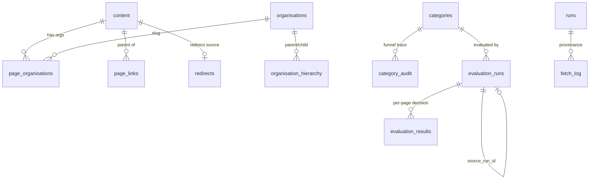

# Database

The corpus and the Shortlist Builder app share one relational database. This document
describes the **stack**, the **conventions**, and the **data structure** (every table,
grouped by purpose).

The authoritative schema lives in two files that are kept deliberately parallel:

- [`govuk_corpus/schema_pg.sql`](govuk_corpus/schema_pg.sql) — **Postgres** (production).
- [`govuk_corpus/schema.sql`](govuk_corpus/schema.sql) — **SQLite** (local pilot / tests).

If this document and those files ever disagree, the `.sql` files win.

---

## 1. Stack

| | Production | Pilot / tests |
|---|---|---|
| Engine | **PostgreSQL** | **SQLite** (single file; `:memory:` in tests) |
| Driver | `psycopg` (v3) | stdlib `sqlite3` |
| Placeholder | `%s` | `?` |
| Module | [`govuk_corpus/db_pg.py`](govuk_corpus/db_pg.py) | [`govuk_corpus/db.py`](govuk_corpus/db.py) |
| Keyword search | GIN full-text (`tsvector`) | `LIKE` fallback |

### Backend selection

[`govuk_corpus/backend.py`](govuk_corpus/backend.py) chooses the backend **from the
environment** and every module imports the active one as `from .backend import db`:

```python
if os.getenv("DB_BACKEND") == "postgres" or os.getenv("DB_HOST"):
    from . import db_pg as db     # Postgres
else:
    from . import db as db        # SQLite (default)
```

The two modules expose the **same function names and signatures**, so stage code and the
web app run unchanged on either. Code that must vary a literal by backend checks a flag
derived once per module:

```python
_IS_PG = db.__name__.endswith("db_pg")
_P = "%s" if _IS_PG else "?"        # the parameter placeholder
```

### Connection

- **Postgres** reads its DSN from env: `DB_HOST`, `DB_PORT` (5432), `DB_NAME`
  (`gov_uk_corpus`), `DB_USER` (`corpus`), `DB_PASSWORD`. On the server these come from
  `~/gov-uk-corpus.env` (chmod 600) loaded by the `corpus-shortlist` systemd service.
  Connections use `psycopg.rows.dict_row`, and an optional per-connection
  `statement_timeout` (`DB_STATEMENT_TIMEOUT_MS`) so a slow ad-hoc query can't hang a
  request.
- **SQLite** opens the file with `row_factory = sqlite3.Row` and `PRAGMA journal_mode=WAL`.
  It accepts (and ignores) `statement_timeout_ms` for signature parity.

Both expose `connect(...)` and `init_db(conn)` (which just executes the matching schema
file — every statement is `CREATE ... IF NOT EXISTS` / `ADD COLUMN IF NOT EXISTS`, so it
is safe to run on every startup and doubles as the migration mechanism).

### Conventions

The schema is kept simple and portable rather than fully "Postgres-native", so migration
is mechanical:

- **Timestamps** are `text`, stored as ISO-8601 UTC strings (`now_iso()`), not
  `timestamptz`. Freshness comparisons rely on lexical ISO ordering.
- **Boolean flags** (`is_redirect`, `withdrawn`, `include_child_orgs`, …) are `smallint`
  / `INTEGER` holding `0` / `1`.
- **Structured blobs** (`content`, `counters`) are stored as raw JSON **text**, not
  `jsonb`. Derived/queryable fields are normalised out into columns or side tables.
- **URLs are identity.** `content.url` is the primary key, always the canonical
  `https://www.gov.uk/...` form produced by [`canonical.canonicalise`](govuk_corpus/canonical.py)
  (https, host normalised to `www.gov.uk`, query/fragment dropped, trailing slash
  stripped). Canonicalisation is applied on every insert and every join.

---

## 2. Data model at a glance



Tables fall into four groups:

1. **Corpus & crawl provenance** — the pages themselves and how they were gathered.
2. **Organisation registry** — the department taxonomy used to expand filters.
3. **Shortlist builder** — saved shortlist specs and their deterministic funnel audit.
4. **AI evaluation** — per-run LLM decisions, spend, models, and settings.

---

## 3. Corpus & crawl provenance

### `content` — the one-page corpus

Every gov.uk page the pipeline knows about: sitemap pages, redirect targets, and
attachment/child pages. **~877k rows** in production. Primary key `url`.

Key columns:

| Column | Meaning |
|---|---|
| `url` | Canonical `https://www.gov.uk/...` (PK). |
| `content` | Raw `/api/content` JSON for the page (large; TOASTed in PG). |
| `content_hash` | Hash of the fetched body; **`NULL` ⇒ page not yet fetched** (used as the "usable page" guard). |
| `search_text` | HTML-stripped body text, for keyword search / readability. |
| `document_type` | gov.uk document type (e.g. `guidance`, `html_publication`). |
| `parent_document_type` | For `html_publication` pages, the parent publication's type (backfilled from `links.parent[].document_type`). |
| `schema_name` | gov.uk schema name. |
| `title`, `description` | Page title / meta description. |
| `first_published_at`, `public_updated_at` | gov.uk publication dates (freshness banding). |
| `withdrawn` | `1` if the page is withdrawn. |
| `is_redirect`, `destination_url` | `1` + target if the URL is a redirect (kept in the corpus but **excluded from all shortlist queries**). |
| `source` | How it entered the corpus: `sitemap` / `attachment` / `redirect` / `seed` / `other`. |
| `sitemap_lastmod` | `lastmod` from the sitemap (`NULL` if not discovered that way). |
| `first_seen_*`, `last_seen_*`, `last_changed_*` | Provenance: run id + timestamp for first seen, last seen, last changed. |
| `reading_age`, `gds_english_score`, `gds_findings` | Readability / plain-English analysis of `search_text` (populated by a later job). |
| `search_tsv` *(PG only)* | `GENERATED ALWAYS AS ... STORED` tsvector over title+description+search_text; GIN-indexed. |

### `sitemap` — the crawl frontier

Discovered URLs (`url` PK) with the `sitemap_file` and `lastmod` they came from, and
when they were imported.

### `page_organisations` — page ↔ organisation

Organisations linked to a page, normalised out of the content JSON.
PK `(page_url, organisation_content_id, role)`; `role` is `primary` | `related`;
`organisation_slug` (indexed) joins to `organisations`.

### `page_links` — page ↔ page

Parent → child/attachment relationships between pages that both live in `content`.
PK `(parent_url, child_url, relation)`; `relation` is `attachment` | `part` | `related`.

### `redirects` — resolved redirects (Stage 2)

`source_url` (PK) → `destination_url`, with the resolving `http_status`, run, and time.
Mirrors the `is_redirect`/`destination_url` columns on `content`.

### `runs` — stage provenance

One row per recorded execution of a pipeline stage. `run_id` (uuid4) PK; `status`
(`running` | `complete` | `failed`), `stage` (`sitemap` | `align` | `redirect` |
`attachment`), `scope` (e.g. `defra-pilot` | `whole-govuk`), and a `counters` JSON blob.
The `first_seen_run` / `last_seen_run` / `last_changed_run` columns on `content` point
back here.

### `fetch_log` — per-URL audit trail

The detail behind the run counters: one row per URL per stage, with `action`
(`new` | `changed` | `unchanged` | `redirect` | `error` | `skipped` | `invalid` |
`no_content_item`), `http_status`, `bytes`, `duration_ms`, `error`. Indexed by `run_id`.

---

## 4. Organisation registry

### `organisations`

Registry imported from the gov.uk search-API org aggregate. `slug` (PK) matches
`page_organisations.organisation_slug`; carries `title`, `acronym`, `content_id`,
`org_type`, `org_state`, `brand`, `analytics_identifier`.

### `organisation_hierarchy`

Parent → child department edges (PK `(parent_slug, child_slug)`, both indexed). Lets a
chosen organisation expand to its child departments (the categories'
`include_child_orgs` flag), resolved with a `WITH RECURSIVE` walk in
[`orgs.py`](govuk_corpus/orgs.py).

---

## 5. Shortlist builder

### `categories` — saved shortlist specs

A "category" is a saved shortlist definition, CRUD'd from the Shortlist Builder UI.
`id` is an epoch-ms integer assigned in Python. Two kinds of field:

- **Filter fields** (executed against the corpus): `dept_slugs`, `include_child_orgs`,
  `document_type_slugs`, `keywords`.
- **Inference fields** (stored for the downstream LLM phases): `inclusion_context`,
  `exclusion_context`, `adjudication_hints_keep`, `adjudication_hints_drop`,
  `extra_guidance_urls` / `only_use_extra_guidance_urls`, `extra_law_urls` /
  `only_use_extra_law_urls`.

Plus `status` (`draft` | `published` | `archived`), `slug` (lowercase_underscores
name), `owner_email`, `description`, and `created_at` / `updated_at`. Slug-style list
fields are stored as delimited text.

### `category_audit` — deterministic funnel trace

Per-page record of how a category's funnel treated each page, starting **after** the
organisation filter (so the whole corpus is never logged). PK `(category_id, url)`;
`outcome` is `included` | `dropped: document type` | `dropped: keyword`. Indexed by
`(category_id, outcome)`.

---

## 6. AI evaluation

The deterministic shortlist feeds an AI layer that runs in **phases**
(Phase 1 Inclusion → Phase 2 Exclusion → Phase 3 Adjudication), tracked per run so
different models can be compared over the same shortlist.

### `evaluation_runs`

One row per evaluation run. `run_id` (PK); `category_id` (indexed); `name` (editable
label, e.g. `Test-1`); `phase`; `provider` (`anthropic` | `deepseek` | …); `model`
(requested id) and `actual_model` (what the API served); `source_run_id` (the run this
one builds on — an exclusion run points at its inclusion run). Totals:
`pages`, `kept`, `dropped`, `unparseable`, `cost`, `in_tokens` / `out_tokens`,
`hit_tokens` / `miss_tokens` (cache hit vs miss for cost), `total_ms`, `started_at` /
`finished_at`.

### `evaluation_results`

The per-page decision for a run. PK `(run_id, url)`; `keep` (0/1), `score`, `reason`,
`ms`, `created_at`. Indexed by `(run_id, keep)`. Decisions are per-run, so a page can be
kept in one run and dropped in another.

### `ai_usage` — spend ledger

One row per successful model call (`day`, `created_at`, `cost`, `input_tokens`,
`output_tokens`, `kind`). Indexed by `day` — this is what the daily-budget guardrail and
the daily-spend bar sum over.

### `ai_models` — user-editable model catalogue

Suppliers + model ids + a **tiered price grid** (USD per 1M tokens): input × {cache hit,
cache miss} × {off-peak, peak}, and output × {off-peak, peak}. `input_per_m` /
`output_per_m` are the "standard" rates (= cache-miss off-peak / output off-peak).
`id` is epoch-ms; indexed by `(provider, model_id)`.

### `app_settings` — key/value

Small `key` → `value` store for app settings: the active model id, per-phase model
selection (`phase_model_inclusion` / `_exclusion` / `_adjudication`), the daily budget,
max docs per run, per-category funnel caches, and similar.

---

## 7. Keyword search

Keyword filtering is the one place the two backends genuinely differ, handled in
`_keyword_clause` ([`shortlist.py`](govuk_corpus/shortlist.py)):

- **Postgres** — stemmed full-text: `search_tsv @@ plainto_tsquery('english', %s)`,
  backed by the GIN index `idx_content_search_tsv`. `search_tsv` is a stored generated
  column over `title + description + search_text`, so it recomputes automatically as the
  body backfill fills `search_text`.
- **SQLite (pilot)** — a case-insensitive `LIKE` over
  `title || description || search_text` (no stemming). Adequate for the small pilot DB.

Multiple keywords are combined with `AND` or `OR` per the category's `match` mode.

---

## 8. Indexes & the "usable page" guard

Every shortlist query carries a guard — a page only counts if it is a real, fetched
page: `is_redirect = 0 AND content_hash IS NOT NULL`. Two **partial indexes** cover it
so the common counts stay index-only:

- `idx_content_usable` on `content(url) WHERE is_redirect = 0 AND content_hash IS NOT NULL`
- `idx_content_usable_doctype` on `content(document_type) WHERE …`

Other notable indexes: `idx_content_document_type`, `idx_content_parent_document_type`,
`idx_content_source`, `idx_page_orgs_slug` (drives the organisation semi-join),
`idx_org_hier_parent` / `_child`, `idx_eval_runs_cat`, `idx_eval_results_run_keep`,
`idx_ai_usage_day`, and (PG) the GIN `idx_content_search_tsv`.

> On ~877k rows, building the STORED `search_tsv` column and the partial indexes rewrites
> / locks `content` briefly. In production, create the heavy indexes once by hand with
> `CREATE INDEX CONCURRENTLY` before deploying to avoid the startup lock.

---

## 9. Derived columns & backfills

Some `content` columns are populated by jobs after the initial crawl, so they fill in
progressively:

| Column(s) | Backfill |
|---|---|
| `search_text` | `build_search_text` (HTML-stripped body) |
| `search_tsv` *(PG)* | automatic — generated column |
| `parent_document_type` | `backfill_parent_document_type` (from `links.parent[]`) |
| `public_updated_at` | `backfill_public_updated_at` |
| `reading_age`, `gds_english_score`, `gds_findings` | readability / `build_readability` |
| `page_organisations` | `backfill_organisations` (normalised from the JSON) |

Because these are additive and guarded (`COALESCE`, `IF NOT EXISTS`), queries degrade
gracefully while a backfill is mid-run.
