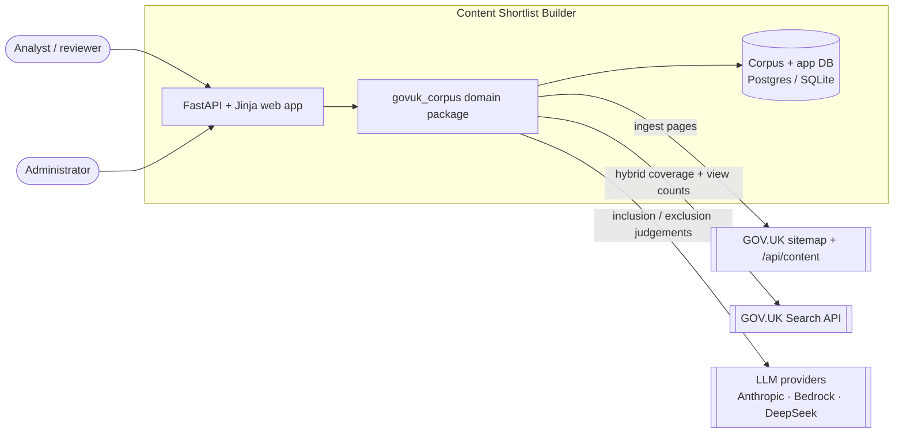
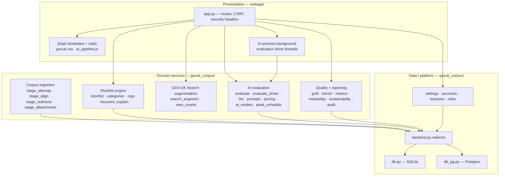
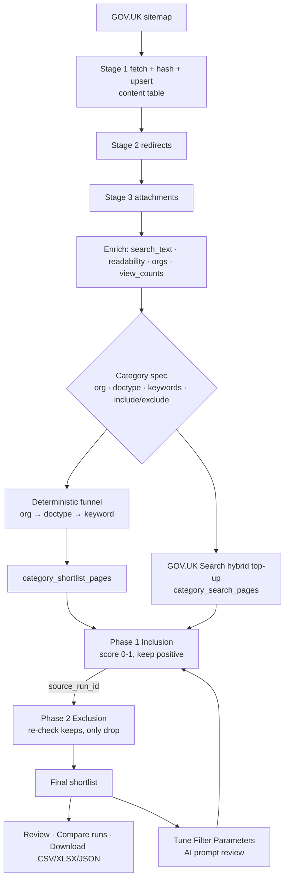
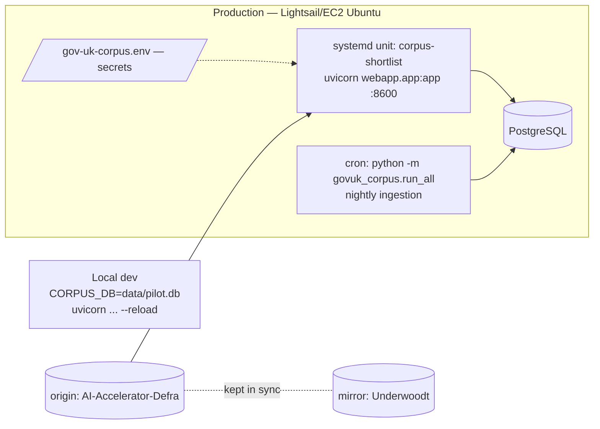

# Architecture — GOV.UK Content Shortlist Builder

**Status:** Living document · **Reflects:** `main` as currently built · **Owner:** DEFRA AI Accelerator
**Related:** [README](../README.md) · [database.md](../database.md) · [RUNBOOK](../RUNBOOK.md) · [PAGE_INDEX](../PAGE_INDEX.md) · [journey guides](journeys/README.md)

> Scope: this describes the **Content Shortlist Builder** — the FastAPI/Jinja web app plus its
> `govuk_corpus` domain package. An earlier crawler/search-API stack (`api/`, `docker-compose.yml`,
> `jobs/scheduler.py`) still exists in the repository but is **not** part of the current system; it
> is called out explicitly in §11 so it doesn't muddy the picture.

---

## 1. Purpose

GOV.UK is enormous. Analysts frequently need **a defensible list of the pages about one topic, owned
by the right organisations** — not all of GOV.UK. The Shortlist Builder lets a user save a *category*
(a reusable query: organisations + document types + keywords + AI include/exclude criteria), narrows
a local corpus of ~877k GOV.UK pages with a **deterministic selection funnel**, then runs a
**two-phase LLM pass** to judge the survivors, producing a reviewable, exportable, and **fully
explainable** shortlist. Every mechanical and AI decision can be traced back to "why this page?".

## 2. System context

**Actors:** analysts/reviewers (build, run, review, export, tune shortlists) and administrators
(models, budget, users, settings). **External systems:** the GOV.UK **sitemap** and **content API**
(corpus source), the GOV.UK **Search API** (hybrid coverage + popularity), and **LLM providers**
(the inclusion/exclusion judgements).

## 3. Architecture overview

Two first-class pieces with a strict dependency direction — **the web app imports the domain
package; the package never imports the web app** — so all domain logic is testable without FastAPI.

**Backend-agnostic persistence.** `backend.py` picks the concrete DB module **at import time** —
`db_pg.py` (PostgreSQL, psycopg 3) when `DB_BACKEND=postgres`/`DB_HOST` is set, otherwise `db.py`
(SQLite). Every module does `from .backend import db` and uses `_P` as the paramstyle placeholder, so
the same SQL runs on both. Schema lives in `schema.sql` (SQLite) with a Postgres twin `schema_pg.sql`;
idempotent column migrations run in each backend's `init_db()` on startup.

## 4. Components & responsibilities

### 4.1 Presentation — `webapp/`
- **`app.py`** — the entire FastAPI application (routes, a few inline auth-page HTML fragments, and
  the background evaluation driver). Delegates all domain work to `govuk_corpus`. Route groups: auth &
  accounts; categories/shortlists; AI pipeline & runs; analysis/compare; gold & bench; GOV.UK-Search
  hybrid; downloads/export; admin & settings; help; feedback. A JSON API (`/api/...`) backs the
  interactive pages.
- **Middleware:** a global **CSRF double-submit** guard (`X-CSRF-Token` header or `csrf` form field
  must equal the `sb_csrf` cookie; safe methods pass), and a security-headers layer
  (`X-Content-Type-Options`, `X-Frame-Options: SAMEORIGIN`, referrer policy; sets the CSRF cookie). A
  Content-Security-Policy is **not yet** set (inline scripts/styles remain).
- **Templates** (`templates/`, all extend `base.html`) — the category form, preview/pipeline tabs
  (`_category_tabs.html`, `_ai_pipeline.html`, `ai_pipeline_page.html`), the selection funnel, the
  results/audit tables, the download page, the analysis/compare/run-detail pages, gold-labelling,
  settings, accounts, and Help (`help_index.html`/`help_page.html`). `static/` holds `govuk.css` and
  `ai_pipeline.js`.
- **Background evaluation driver** — see §5.4.

### 4.2 Domain — `govuk_corpus/`
- **Corpus ingestion:** `stage_sitemap` (frontier), `stage_align` (fetch `/api/content`, hash, upsert),
  `stage_redirects` (resolve to final destination), `stage_attachments` (expand child/attachment
  pages), with `canonical` (URL normalisation), `hashing`, `extract`/`text`, `build_search_text`,
  `view_counts`, `reconcile`, and `run_all` (the nightly orchestrator).
- **Shortlist domain:** `categories` (saved specs CRUD + validation), `shortlist` (the deterministic
  org→doctype→keyword engine, Postgres full-text), `keyword_explain`, `orgs` (registry + hierarchy),
  `facets`/`category_counts` (UI pickers + precomputed sizes), `audit`/`audit_stats` (per-page funnel
  outcomes), `category_interview` (guided builder), `category_transfer` (export/import a category).
- **AI evaluation:** `evaluate` (prompt builders, parsers, run persistence, `prompt_spec_json`),
  `evaluate_driver` (per-page `evaluate_one_page` + `persist_result`, shared by the web driver, the
  retry path and the bench CLI), `llm` (the single model-call site, `PROVIDERS`, credentials, and the
  daily budget/`ai_usage` ledger), `prompts` (the four prompts, versioned by git SHA), `pricing`
  (tiered grid × peak schedule), `ai_models` (price registry), `peak_schedule` (per-supplier 168-cell
  peak bitmap), `guardrails` (pre-screen user text sent to an LLM).
- **Quality & reporting:** `gold` + `bench` + `bench_metrics` (the pipeline quality benchmark against
  a human gold set), `metrics` (dashboard queries), `readability` (GDS plain-English analysis),
  `sustainability` (modelled energy/impact of runs), `reporting`, `feedback`, `help_docs`.
- **Platform:** `backend`/`db`/`db_pg`, `settings`, `accounts`/`sessions`/`roles`, `config`.

## 5. Key workflows / data flow

1. **Corpus ingestion** (`run_all`, nightly) — sitemap → fetch/hash/upsert → resolve redirects →
   expand attachments, then build `search_text`, readability, org links and view counts. Each stage is
   a recorded `runs` row with a `fetch_log`; change detection is by content hash.
2. **Deterministic shortlist** (`shortlist.py`) — filter the corpus by organisation → document type →
   keyword (Postgres full-text / SQLite LIKE); persist membership to `category_shortlist_pages`; log
   the per-page funnel to `category_audit`. Deterministic: same spec + corpus ⇒ same shortlist.
3. **GOV.UK-Search hybrid top-up** (`search_augment.py`) — an org-scoped GOV.UK Search of the same
   keywords finds pages the keyword filter missed; each page is tagged `shortlister` / `both` /
   `search` and stored in `category_search_pages` (kept separate so a save-rebuild can't wipe it).
4. **Two-phase AI evaluation** — **Phase 1 Inclusion** scores every forwarded page 0.0–1.0 and keeps
   any positive score (with a reason, `primary_topic`, evidence); **Phase 2 Exclusion** builds on that
   run via `source_run_id`, re-checks only the keeps and can **only drop**, fed the Phase-1 topic/reason.
   Driven page-by-page by `evaluate_driver`, in parallel waves (default 10 at a time), honouring the
   per-run page cap and the daily budget, with an end-of-run **reprocess phase** that retries
   unparsable replies with exponential backoff. A Phase 3 Adjudication exists in the schema for gold.
5. **Outputs** — the results table, run-to-run **Compare Runs** analysis (repeatability &
   discrimination), GDS-compliance, and **downloads** (CSV / XLSX via openpyxl / JSON / bundle).
6. **Tuning loop** — editing Filter Parameters changes only what the **next** run does (existing runs
   are fixed snapshots); an on-page AI **prompt review** reads previous results and suggests sharper
   include/exclude wording. See [Journey 7](journeys/7-edit-filter-parameters.md).

## 6. Data model (summary)

Full reference: [database.md](../database.md). Grouped tables:

- **Corpus / content:** `content` (the one page corpus, canonical-URL PK: raw JSON, `content_hash`,
  `search_text`, readability, doc-type/schema, dates, `content_id`, `view_count`), `sitemap`,
  `page_organisations`, `page_links`, `redirects`, `organisations` + `organisation_hierarchy` +
  `organisation_page_counts`; `runs` + `fetch_log` (ingestion provenance).
- **Categories / shortlist membership:** `categories` (epoch-ms PK; filter + inference fields),
  `category_page_counts`, `category_shortlist_pages` (deterministic membership + matched keywords),
  `category_search_pages` (hybrid membership + provenance + `es_score`), `category_audit`; view
  `category_shortlist_report`.
- **Evaluation:** `evaluation_runs` (one AI run: `category_id`, `source_run_id` chain, `phase`,
  provider/model/`actual_model`, counters, cost + token breakdown, `run_status`/`pid`/`host`/
  `heartbeat_at`, `prompt_spec` JSON snapshot, `stop_reason`), `evaluation_results` (per page per run:
  keep/score/reason, `raw_reply`, grounding fields, `content_hash`, API `stop_reason`, ms), `ai_usage`
  (spend ledger), `ai_models`, `app_settings`.
- **Gold / bench:** `category_gold_labels` (consensus human verdict + strata), `category_gold_votes`.
- **Accounts / sessions:** in `schema_auth.sql` (Postgres `auth` schema); roles are code-level
  (`roles.py`).

**Key relationships:** `category_id` links a category to its shortlist/search/audit/eval/gold rows;
`evaluation_runs.source_run_id` chains an exclusion run to its inclusion run; `content.content_id` is
the cross-URL identity used for membership; `page_organisations`/`page_links`/`redirects` hang off
`content.url`.

## 7. Technology stack

- **Web:** FastAPI 0.104, Uvicorn, Jinja2, python-multipart; Pydantic 2. Front end is server-rendered
  HTML + `govuk.css` (GOV.UK/DEFRA Design System) and a little vanilla JS (`ai_pipeline.js`); no SPA
  framework, no CDN scripts.
- **Data:** PostgreSQL (psycopg 3) in production; SQLite for local/dev and tests. One schema per
  backend, kept in step by `init_db()` migrations.
- **AI:** the **Anthropic SDK** (`anthropic[bedrock]`) is the single call path for all three providers
  — Anthropic direct, AWS **Bedrock** (`AnthropicBedrock`), and **DeepSeek** via its
  Anthropic-compatible endpoint. Default model `claude-haiku-4-5`.
- **Other:** openpyxl (XLSX export), argon2-cffi (Argon2id password hashing), html2text, sqlparse,
  python-dotenv. Corpus ingestion uses **httpx** (see the dependency note in §11).

## 8. Runtime & deployment

- **Production (authoritative):** `uvicorn webapp.app:app` on **port 8600** under the **systemd** unit
  `corpus-shortlist` (`deploy/corpus-shortlist.service`), against PostgreSQL, secrets in
  `EnvironmentFile=/home/ubuntu/gov-uk-corpus.env`. Deploy = commit → push `origin` **and** `mirror` →
  on the box `git fetch` + `reset --hard origin/main` → `systemctl restart corpus-shortlist`. The `main`
  branch is kept identical on both remotes.
- **Local dev:** SQLite (`CORPUS_DB=data/pilot.db uvicorn webapp.app:app --reload --port 8600`).
- **Nightly ingestion:** `python -m govuk_corpus.run_all` (Stage 0→3 + tidy-up) as a scheduled job on
  the box.
- **Concurrency model:** evaluation runs execute **in-process** on the web server (background daemon
  threads), not as separate workers — so a run does **not** survive a service restart (a stalled run is
  detectable via `run_status`/`heartbeat_at`/`pid` and resumable with *Complete run*).

## 9. Cross-cutting concerns

- **Auth:** `AUTH_MODE` env — `shared` (single dashboard password, one global role) or `accounts`
  (per-user Argon2id accounts + server-side sessions, Postgres `auth` schema). **Roles** (`roles.py`):
  Administrator / User / Tester, used for feature gating.
- **CSRF:** global double-submit guard + `sb_csrf` cookie (see §4.1); a client-side `window.fetch`
  shim adds the header to same-origin state-changing requests.
- **Interface levels:** a client-side `data-ui-level` (simple / advanced / expert / admin, default
  **simple**, stored in `localStorage`, chosen on Profile) progressively reveals elements tagged
  `data-level`. The Help journeys are written for the simple level.
- **Cost & budget guardrails:** every successful model call logs cost + tokens to `ai_usage`; a
  configurable **daily budget** (default $20) stops runs when hit; a **per-run page cap** (~600) paces
  spend; pricing is a tiered per-model grid × a per-supplier peak/off-peak schedule. Runs record a
  precise `stop_reason` (`budget` / `cap` / `provider_errors` / `balance` / `config` / `manual`), which
  the UI surfaces (e.g. a low-balance stop advises checking the Anthropic credit balance).
- **Reproducibility:** each run stamps a `prompt_spec` JSON snapshot (template + git version + the
  category's include/exclude/keep/drop text + body limit + sampling), so a run's exact prompts are
  reconstructable later even after the category or templates change. Prompts are **versioned by git
  SHA** (the old `prompt_versions` table was retired).
- **Observability:** Python `logging`; ingestion provenance in `runs` + `fetch_log`; run liveness in
  `run_status`/`pid`/`host`/`heartbeat_at`; SDK retries via `AI_MAX_RETRIES`/`AI_TIMEOUT`.
- **Sustainability:** `sustainability.py` models energy/water/CO₂ impact from run token usage
  (a Sustainability page).
- **Page-id convention:** every rendered page shows a unique `guc-NNNN` id (retired-never-reused;
  registry in `PAGE_INDEX.md`), aiding support and documentation.
- **In-app Help:** `help_docs.py` renders `docs/journeys/*.md` as Help pages, so user documentation has
  a single source of truth with the repo.

## 10. Key design decisions

| Decision | Rationale |
|---|---|
| **Deterministic filters, then AI judgement** | The mechanical narrowing (org/doctype/keyword) is fast, exact and cheap; the LLM only judges the survivors. Every stage is explainable. |
| **Two phases (Inclusion → Exclusion)** | A generous "does this belong?" keep, then a strict "is this a look-alike?" drop — a kept page has passed both tests. |
| **Backend-agnostic data layer** | SQLite for zero-setup local/dev and fast tests; PostgreSQL (full-text, concurrency) in production — one SQL surface via `_P`. |
| **Domain package independent of the web app** | Domain logic is unit-testable without FastAPI; the same `evaluate_driver` powers the web driver, the retry path, and the bench CLI. |
| **Per-run `prompt_spec` snapshot + git-versioned prompts** | Runs are exactly reproducible and comparable; you always know what a run actually asked. |
| **Hybrid membership kept in a separate table** | GOV.UK-Search-only pages survive a save-rebuild of the deterministic shortlist. |
| **In-process background threads (not a worker queue)** | Simplicity for a single-box pilot; the trade-off is no survival across restarts, mitigated by heartbeat-based stalled-run detection + resume. |
| **Human gold set + deterministic checks for quality** | The benchmark measures precision/recall, run-to-run stability and grounding against verified truth, not an LLM judge. |

## 11. Known limitations, prototype & vestigial areas, risks

- **Vestigial legacy stack (not the current system):** `api/` (an older crawler/search API,
  `python -m api.app` on **port 8000**), **`docker-compose.yml`** and the **`Dockerfile`** (they point
  at `api.app` and `jobs/scheduler.py`, and an initdb `database/schema.sql` that is **not** the package
  schema), and **`jobs/scheduler.py`/`tasks.py`** (APScheduler cron over the old URL-crawler model).
  These are superseded by `webapp.app` (8600, systemd) + `govuk_corpus.run_all`. **Docker is not a
  supported deployment of the Shortlist Builder as written** — treat it as legacy until reworked to
  target `webapp.app` and the package schema.
- **AI Assistant** (`/assistant`, `assistant.html`) is an explicit scratch prototype, not core.
- **Root `dashboard.py` / `ui_common.py`** — a separate older metrics dashboard, not wired into the app.
- **Dependency note:** corpus ingestion imports **httpx**, but `requirements.txt` pins **requests** and
  does not list httpx (present only transitively via the Anthropic SDK). Ingestion therefore relies on
  an unpinned transitive dependency — worth pinning `httpx` explicitly.
- **No CSP** yet (inline scripts/styles); a future hardening step.
- **Single-box runtime:** evaluation is in-process, so horizontal scale / restart-survival would need a
  real job queue.
- **Accounts mode is Postgres-only** (`auth` schema); the shared-password mode is the SQLite/dev path.

## 12. Glossary

- **Corpus** — the local `content` table: one canonical row per GOV.UK page.
- **Category / Filter Parameters** — a saved, reusable shortlist spec.
- **Shortlist** — the pages a category's parameters generate (the "Results").
- **Run** — one AI evaluation of a shortlist; an inclusion run + its chained exclusion run.
- **Funnel** — the stage-by-stage narrowing (org → doc type → keyword → AI), shown as counts.
- **`guc-NNNN`** — the per-page id shown in the UI and tracked in `PAGE_INDEX.md`.

---

### Appendix — diagrams

The Mermaid blocks above (context §2, components §3, data flow §5, deployment §8) render on GitHub and
in most Markdown viewers, and are a starting point for a hand-drawn picture. Drop a finished image
under `docs/architecture/` and link it here.
