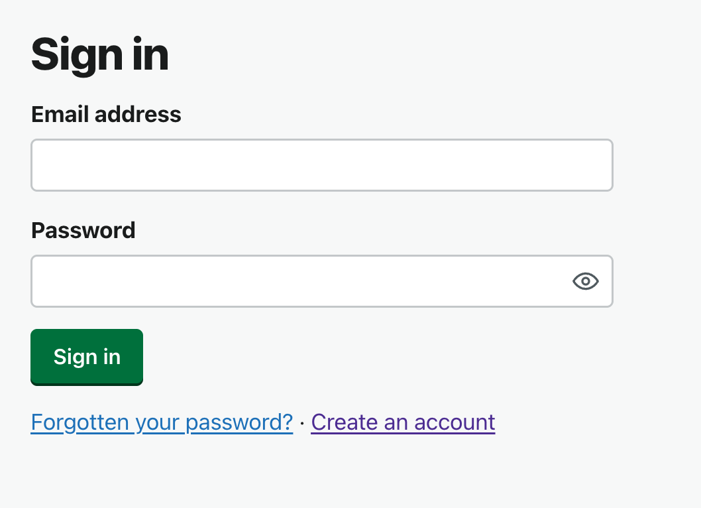
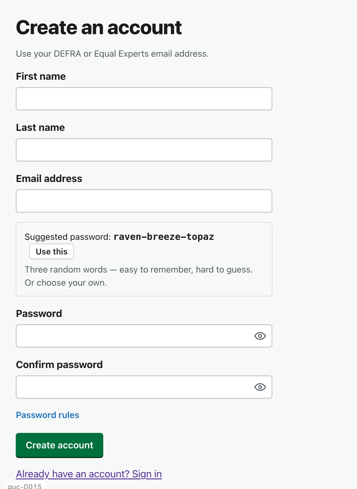
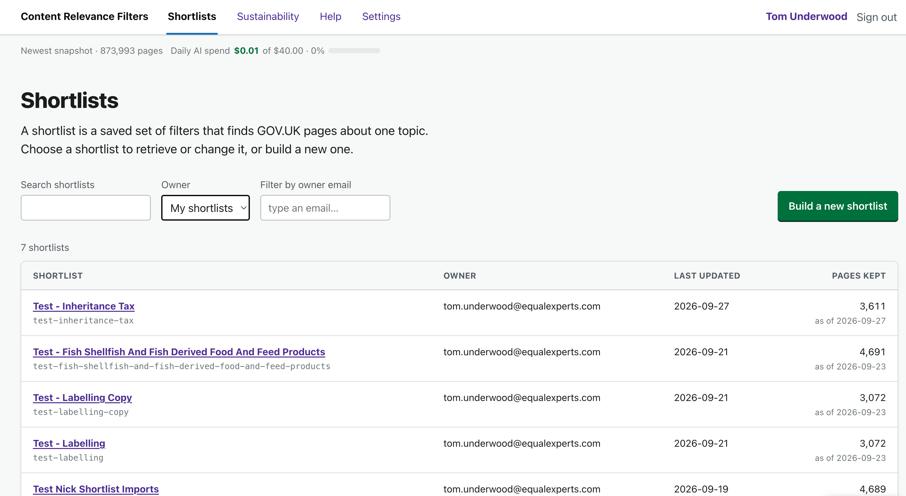
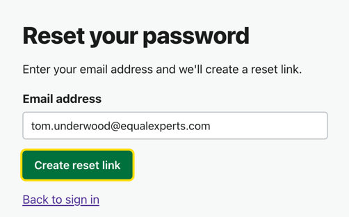

# Journey 1 — Create an account

*What this shows: how a new person gets into the Shortlist Builder for the first time.*

**Who / when:** anyone with a DEFRA or Equal Experts email who has been pointed at the tool.
**Pages used:** Sign in (`/login`) · Register (`/register`) · Forgot password (`/forgot-password`).

---

## The 30-second pitch

> Say: "Getting in takes about a minute. It's tied to your work email — no separate credentials to
> look after — so the person looking at a shortlist is always a known DEFRA or Equal Experts
> account. Let me show you."

---

## Walkthrough

### Step 1 — Open the tool and land on Sign in

**What you do:** open the Shortlist Builder link. If you're not signed in, it takes you straight
to the **Sign in** page.

**What you see:** an email and password box, a **Forgot password** link, and — for newcomers — a
link to **create an account**.

> Say: "Everything sits behind a sign-in, so nothing here is public. If you already have an
> account you'd log in here; the first time, you register."

### Step 2 — Register with your work email

**What you do:** follow **create an account** to the **Register** page and fill in four things:
**First name**, **Last name**, **Email address**, and a **Password** (with **Confirm password**).

**What you see:** a note that you must use your **DEFRA or Equal Experts** email address, and a
**suggested password** you can copy if you'd rather not think one up.

> Say: "It only accepts a DEFRA or Equal Experts address, so accounts always map to real
> colleagues. There's even a suggested strong password if you want one — copy it into a password
> manager and you're done."

**Note:** the email restriction is deliberate — it's the tool's front-door guest list. An address
outside those domains is refused here rather than later.

### Step 3 — Submit and you're in

**What you do:** submit the form. Your account is created and you're signed in.

**What you see:** the **Shortlists** home page — the list of shortlists (empty if you're the first
in, or your team's existing ones if not). That's the start of [Journey 2](2-what-is-a-shortlist.md).

> Say: "And that's it — we're in, looking at the Shortlists page. From here everything is about
> building and reading shortlists."

### If you ever get stuck signing in

**What you do:** use **Forgot password** on the Sign in page to get a reset link by email.

> Say: "Forgot your password? The usual reset-by-email link is right there on the sign-in page —
> no need to ask anyone."

---

## In one breath

> Say: "Open the link, register once with your DEFRA or Equal Experts email, and you land on the
> Shortlists page ready to work — the whole thing is a minute."

## Links

- Next: [Journey 2 — What is a shortlist?](2-what-is-a-shortlist.md)
- Related: Sign in `/login`, Register `/register`, Forgot password `/forgot-password`.
