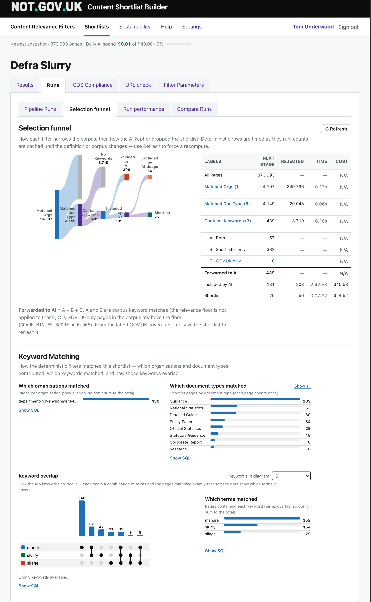
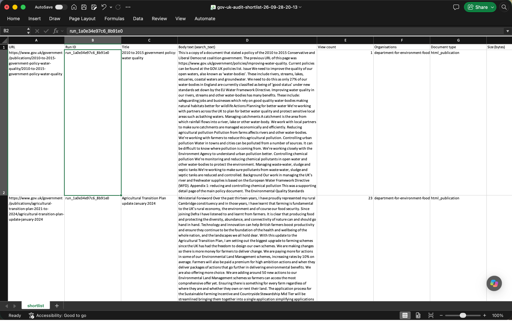
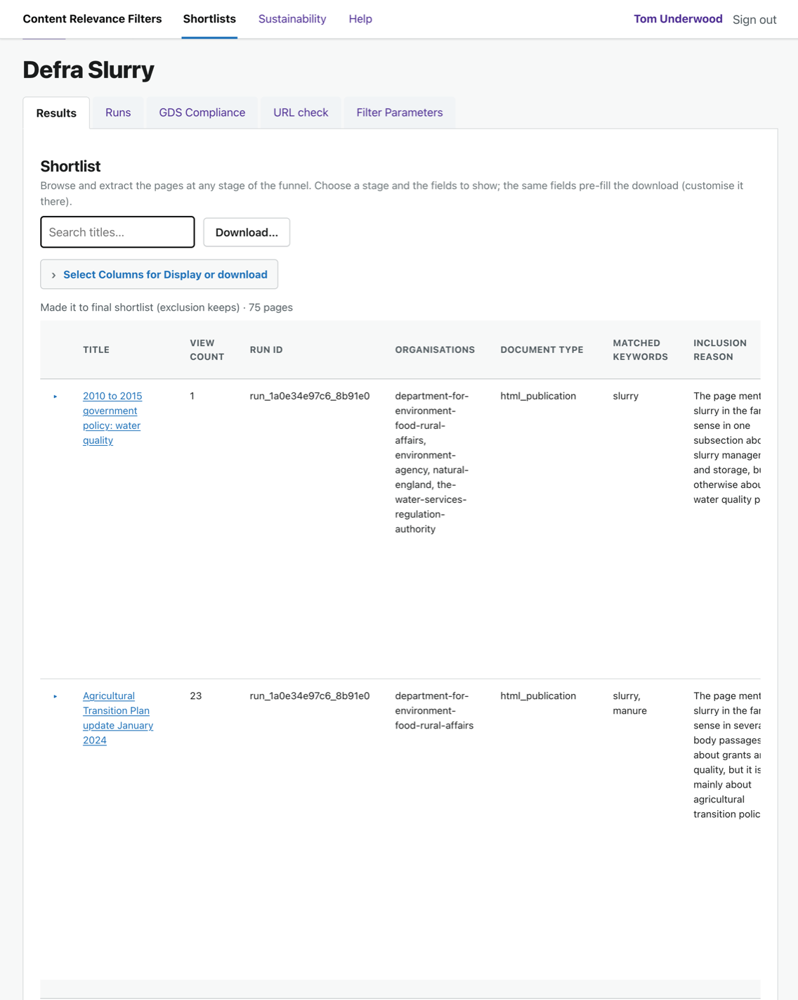

# Journey 2 — What is a shortlist?

*What this shows: the one idea the whole tool is built around, before anyone touches a form.*

**Who / when:** a first-time user (or a stakeholder) who needs the mental model.
**Pages used:** Shortlists home (`/`) and, for orientation, any existing shortlist's tabs.

---

## The 30-second pitch

> Say: "GOV.UK is enormous. Most of the time you don't want *all* of it — you want *the pages
> about one thing*, owned by the right people, that you can defend to someone else. A **shortlist**
> is exactly that list. You don't pick the pages by hand: you set the **Filter Parameters**, and
> the tool generates the shortlist from them. Set it once, and you can re-run it, download it, and
> show your working."

---

## The idea in plain terms

Think of our **corpus** — a large local copy of GOV.UK pages — as a library.

A **shortlist** is the list of GOV.UK pages that your **Filter Parameters** generate from the
corpus. You never add pages by hand — you describe what you want, and the tool generates the list.

The Filter Parameters that generate it have two halves:

1. **Filters** — the mechanical narrowing: which **organisation** owns the page, what **document
   type** it is, and which **keywords** it must contain. These are deterministic — same Filter
   Parameters, same corpus, same shortlist every time.
2. **AI judgement** — for the pages that pass the filters, an AI reads each one and decides whether
   it genuinely belongs, giving a score and a reason. This is where "mentions slurry once in
   passing" gets separated from "is actually about slurry".

The point of keeping these separate: the filters are fast and exact, and the AI only has to judge
the pages that survive — and every decision, mechanical or AI, is **explainable**. You can always
answer "why did the Filter Parameters keep (or drop) this page?"

> Say: "So a shortlist isn't a one-off search you lose when you close the tab. It's generated by a
> saved, re-runnable definition — filters for the easy narrowing, an AI pass for the judgement —
> and it always shows its working."

---

## What a shortlist is *for*

- **A defensible list to hand on** — download it as a spreadsheet with the columns you need.
- **A living view** — re-run it as GOV.UK changes, or after you tweak the definition, and compare.
- **A shared artefact** — a colleague opens the same shortlist and sees the same pages and the same
  reasons; nothing lives only in your head or your browser history.

> Say: "The three things people use it for: get a clean list *out*, keep it *current*, and *share*
> it so everyone's arguing from the same page — literally."

---

## What you see on the Shortlists home page

**What you do:** land on **Shortlists** (where Journey 1 left you).

**What you see:** a list of existing shortlists (each with an owner and its filters) and a **Build a
new shortlist** button. Opening any shortlist reveals its tabs — the shape of everything that
follows:

- **Results** — the list those parameters generated, with the row-level kept/dropped views → [Journeys 4 and 5.2].
- **Runs** — run the AI over the shortlist and see every run; its sub-tabs hold the **Selection funnel** and **Compare Runs** → [Journey 5].
- **Filter Parameters** — where you set the parameters that generate the shortlist, and (after a run) ask the AI to sharpen them → [Journey 3].

> Say: "This home page is just the shelf of saved questions. Open one and you get tabs: see the
> results your parameters generated, run the AI over them, and set the parameters themselves. That's
> the whole loop — and we'll build one from scratch next."

---

## In one breath

> Say: "A shortlist is the clean, explainable, re-runnable list of GOV.UK pages that your Filter
> Parameters generate — filters to narrow, an AI pass to judge."

## Links

- Previous: [Journey 1 — Create an account](1-create-an-account.md)
- Next: [Journey 3 — Create a shortlist](3-create-a-shortlist.md)
