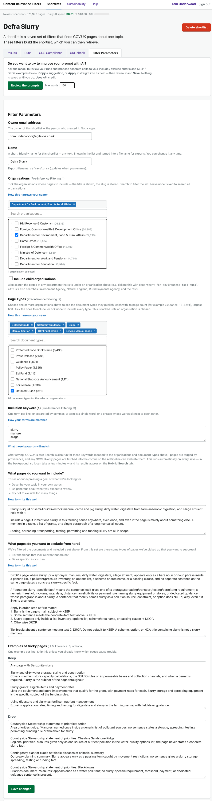
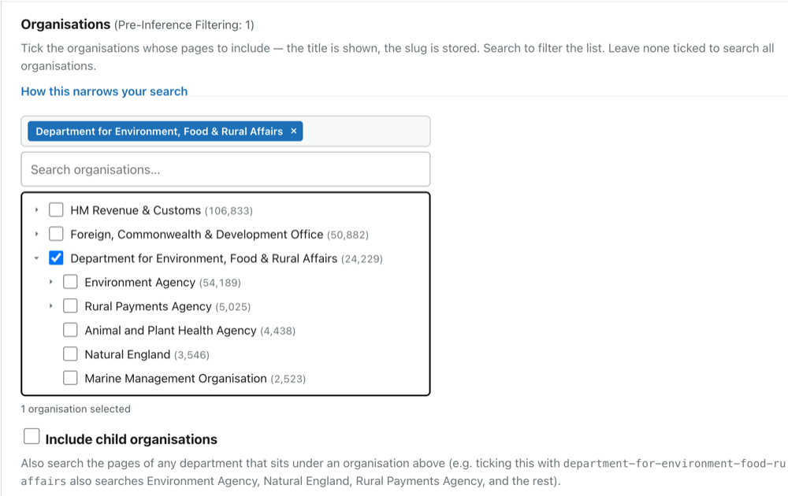
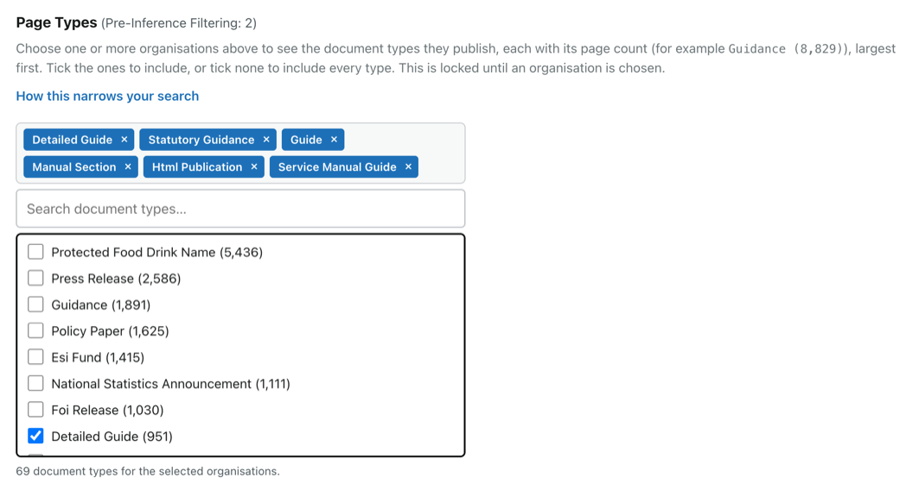
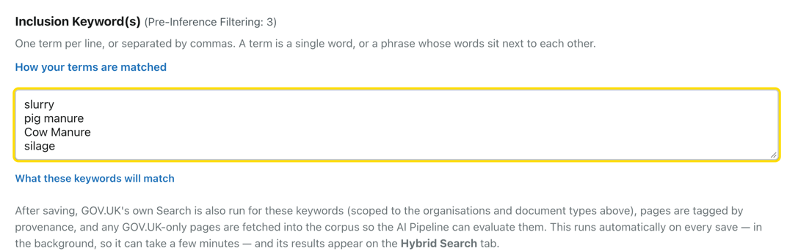
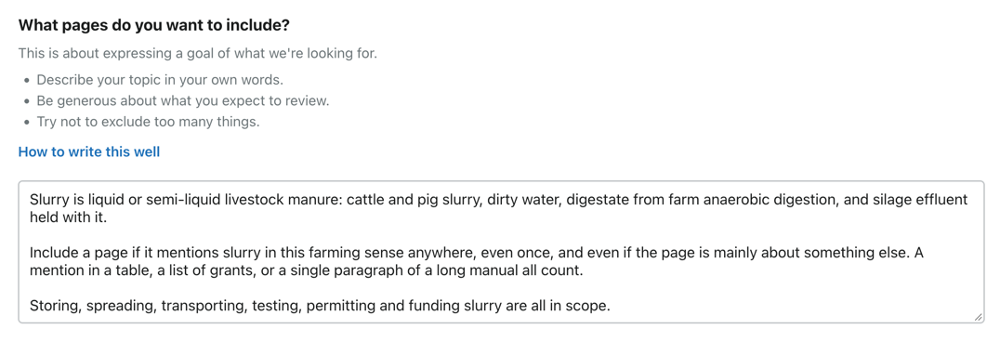
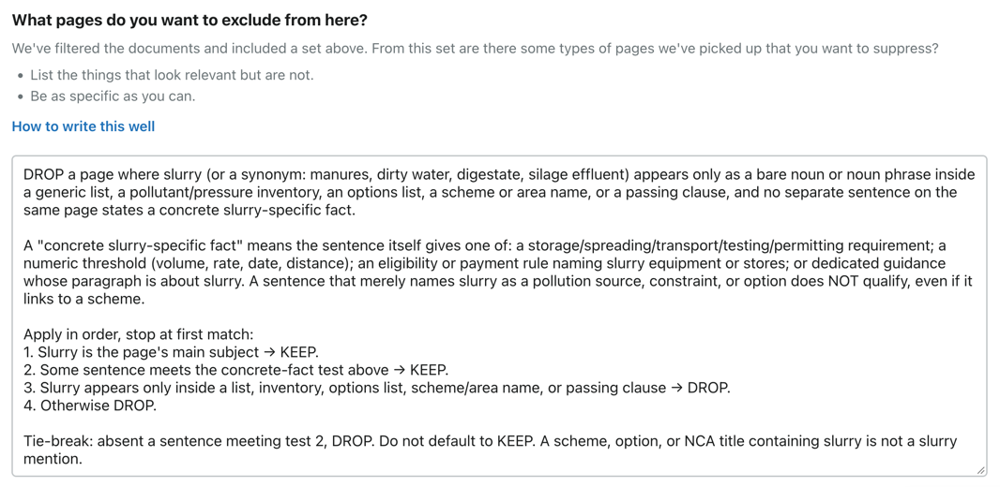
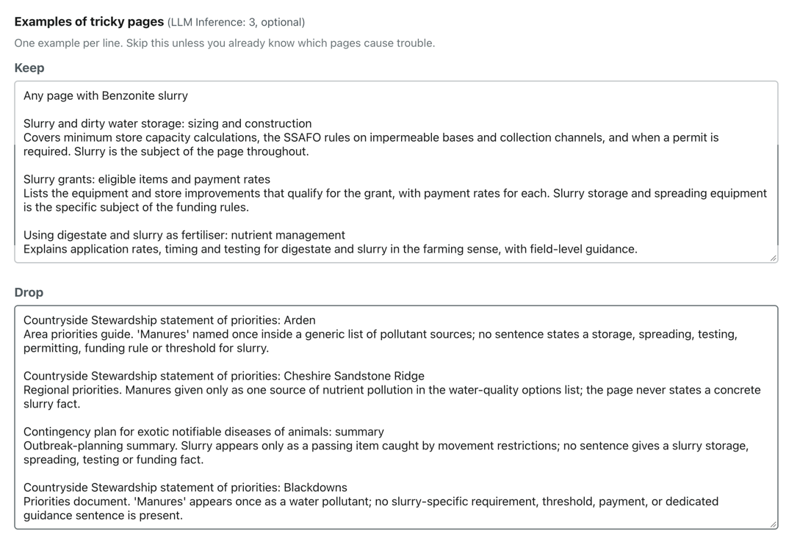

# Journey 3 — Create a shortlist

*What this shows: setting the **Filter Parameters** that generate a shortlist — from picking the
owning organisation down to teaching the AI the tricky judgement calls.*

**Who / when:** a user who knows the topic they want and is ready to define it.
**Pages used:** **Build a new shortlist** → the **Filter Parameters** form.

---

## The 30-second pitch

> Say: "You don't hunt for pages — you *describe* them, and the tool generates the shortlist. The
> form goes from the coarse and certain to the fine and judged: first the mechanical filters —
> organisation, page type, keywords — then a few sentences telling the AI what counts as in or out.
> Five minutes of describing, and you've got a re-runnable, explainable list."

---

## How the form is laid out

Open **Build a new shortlist**. The **Filter Parameters** form runs top to bottom in the order the
tool applies things:

1. **Owner email** and a **Name** for the shortlist (e.g. *Farm slurry storage*).
2. **Pre-Inference Filtering** — the fast, exact narrowing that runs *before* any AI:
   1. **Organisations**, 2. **Page Types**, 3. **Inclusion Keyword(s)**.
3. **LLM Inference** — what you tell the AI: **what to include**, **what to exclude**, and
   optional **Examples of tricky pages**.

Everything above the AI section is deterministic: the same parameters over the same corpus generate
the same shortlist every time. Save at the bottom and the tool generates (or rebuilds) the shortlist.

> Say: "Notice the shape of the form — filters first, because they're cheap and certain, then the AI
> criteria, because that's the judgement. The tool works in exactly that order."

---

## 3.1 — Organisation *(Pre-Inference Filtering: 1)*

**What you do:** in **Organisations**, tick the department or body that owns the pages you want.
It's a searchable, hierarchical tree — parents with their agencies tucked underneath — and each row
shows how many pages that organisation has. Tick **Include child organisations** to sweep in a
department's agencies as well as the department itself.

**What you see:** the tree filters as you type; the counts tell you how big each branch is.

> Say: "Start with *who owns it*. Pick DEFRA, or a specific agency — and if you want the whole
> family, tick 'Include child organisations' to pull in its agencies too. The page counts next to
> each one keep you honest about how much you're letting in."

**Why it's first:** ownership is the most reliable signal on GOV.UK and the biggest single cut — it
takes you from *all of government* to *this organisation's pages* in one tick.

---

## 3.2 — Document types *(Page Types — Pre-Inference Filtering: 2)*

**What you do:** in **Page Types**, tick the kinds of page you want — guidance, detailed guides,
publications, and so on (searchable, like Organisations).

**What you see:** the shortlist-to-be narrows again to just those formats.

> Say: "Next, *what kind of page*. Usually you want guidance and detailed guides, not, say, news
> stories or consultation outcomes. Ticking the page types strips out the formats that aren't the
> job."

**Why it matters:** the same words appear in very different formats. Filtering by page type removes
whole categories of noise (press releases, transparency data) before the AI ever sees them.

---

## 3.3 — Keywords *(Inclusion Keyword(s) — Pre-Inference Filtering: 3)*

**What you do:** in **Inclusion Keyword(s)**, list the words a page must contain — one per line or
comma-separated (e.g. *slurry*, *nitrate*).

**What you see:** the last mechanical cut — only pages whose text contains your keywords survive to
the AI stage.

> Say: "Finally, the words the page has to actually contain. This is a blunt instrument on purpose —
> it's the cheap keyword net that catches the obvious candidates. It will over-catch, and that's
> fine: the AI is about to sort the true matches from the passing mentions."

**Why keep it blunt:** keywords are fast but literal — they can't tell *slurry* the manure from
*slurry* the concrete. You *want* them to over-include here, because the next section is where the
judgement happens.

---

## 3.4 — Prompts: include, exclude, and sorting out the coin-flips *(LLM Inference)*

This is where you stop filtering and start *judging*. The AI reads each page that survived the
filters and decides whether it truly belongs — but it can only be as good as the guidance you give
it here.

### What pages do you want to include?

**What you do:** in a few sentences, describe what genuinely belongs — the scope in your own words.

**What you see:** this becomes the AI's **inclusion criteria** — the yardstick it scores each page
against (0.0–1.0, keeping anything above zero).

> Say: "Describe what you actually mean. Not keywords — meaning. 'Pages about storing and spreading
> livestock slurry and the rules around it.' That sentence is the ruler the AI measures every page
> with."

### What pages do you want to exclude from here?

**What you do:** describe the look-alikes that should be dropped even though they passed the
keyword net.

**What you see:** this becomes the **exclusion criteria** — a second AI pass that re-checks the kept
pages and can only *remove*.

> Say: "Then the traps. 'Slurry can mean coal or concrete — drop those. Drop sewage sludge and
> biosolids.' This is a second, stricter read whose only job is to take out the impostors the first
> pass let through."

### Examples of tricky pages — the coin-flips *(optional)*

Some pages sit right on the line — a grant page that funds slurry stores but is mostly about
payments; a page that mentions slurry once in passing. On a borderline page the AI is essentially
**flipping a coin**, and two runs can disagree.

**What you do:** in **Examples of tricky pages**, give the AI a few worked examples:
- **Keep** — *"a grant page that funds slurry stores even if the rest is about payments."*
- **Drop** — *"sewage sludge or biosolids, not animal slurry."*

**What you see:** these examples steer the borderline calls, so the coin lands the same way every
time — the shortlist stops wobbling between runs.

> Say: "For the genuinely borderline pages, don't argue with the AI in the abstract — *show* it.
> A couple of 'keep this even though…' and 'drop this because…' examples turn a coin-flip into a
> rule. This is the single biggest thing you can do to make runs repeatable."

**Why it's optional but powerful:** you don't need examples if your include/exclude criteria are
already crisp. But when the same page keeps flipping between runs, a Keep/Drop example is the
precise fix — and Journey 5.4 shows how the AI itself can *suggest* these for you.

---

## Save, and the shortlist is generated

**What you do:** **Save** at the bottom of the form.

**What you see:** the tool (re)generates the shortlist from your parameters and moves you on to see
it — the pages the filters kept, ready for the AI pass. That's [Journey 5](5-how-was-this-built.md);
getting the list *out* is [Journey 4](4-download-a-shortlist.md).

> Say: "Save, and the tool generates the shortlist there and then. From here you can look at what it
> produced, run the AI over it, and download it — which is exactly where we go next."

---

## In one breath

> Say: "To create a shortlist you set its Filter Parameters top to bottom — organisation, page type,
> keywords to narrow; then plain-English include and exclude criteria, plus a couple of Keep/Drop
> examples for the coin-flips — and the tool generates the shortlist from them."

## Links

- Previous: [Journey 2 — What is a shortlist?](2-what-is-a-shortlist.md)
- Next: [Journey 4 — Download a shortlist](4-download-a-shortlist.md)
- See it work: [Journey 5 — How was this built?](5-how-was-this-built.md)
