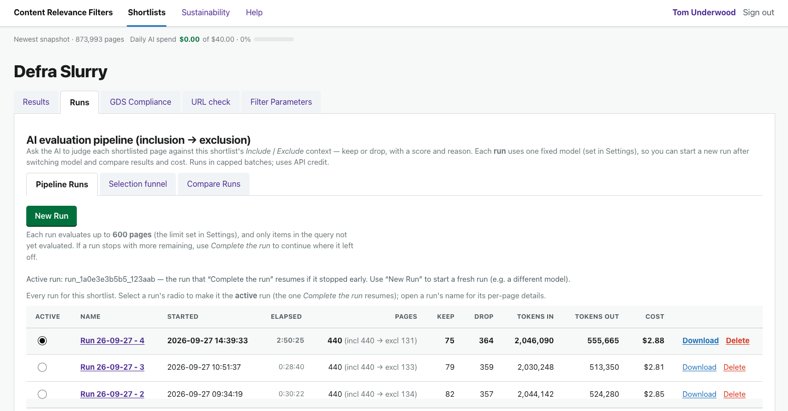
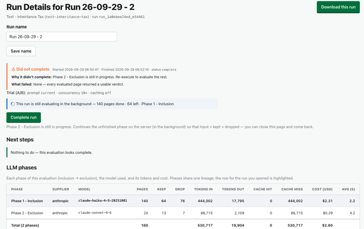
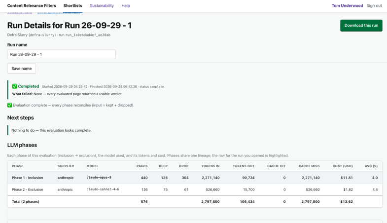
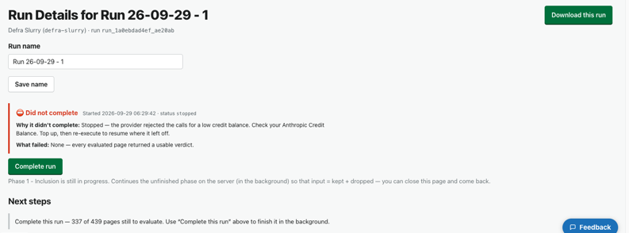

# Journey 4: Run the AI over your shortlist

*What this shows: how to run the AI over your shortlist, watch it work, and tell at a glance whether
it finished cleanly or needs a nudge.*

**Who / when:** you've saved a set of Filter Parameters (Journey 3) and now want the AI to judge the
pages. Everything later (download, compare, tune) reads the runs you make here.
**Pages used:** the **Runs** tab, its **Pipeline Runs** sub-tab, and each run's **Run details** page.

# Journey Overview

Once you've described what you want, running the AI takes one button. On **Pipeline Runs** you press
**New Run**, name it, and **Start Run**, and it works through your pages on the server in two passes:
a generous first pass that scores and keeps, then a stricter one that only removes. You can leave the
page and come back, and when the run stops the **Run outcome** panel tells you in a line whether it
finished, what it cost, and if something went wrong, what to do about it, whether that's
**Complete run**, **Reprocess failed rows**, or topping up your credit.

---

## 4.1: Start a run

> "New Run, give it a name, Start Run. It's running on the server now, so you can close the tab
> and come back to it. It won't stop just because you looked away."

**What you do:** open the **Runs** tab and go to **Pipeline Runs**, where every run lives. Click
**New Run**. The tool creates a run and opens its own page. Give the run a name (the **Start Run**
button stays greyed out until the name is more than three characters), then press **Start Run**.

**What you see:** the run starts working on the server, in the background. You can leave the page and
come back while it keeps going, and a note on the page says so.

**How this helps you:** each run is its own named, saved page, so you can always come back to a
particular run and see exactly what it did.

---

## 4.2: What's happening while it runs

> "It reads your pages twice: a generous first pass that scores and keeps, then a stricter
> second pass that only removes. You watch the counter tick down, and it moves from one pass to the
> next by itself."

**What you do:** watch the live line on the run's page, or on the **Pipeline Runs** list.

**What you see:** the AI reads your pages in two passes. The first pass, Inclusion, reads every page
that got through your filters, gives it a score from 0 to 1, and keeps anything above zero. The
second pass, Exclusion, looks again at only the kept pages and can remove them, but never add. A
live status shows how far it has got ("evaluated 120, 60 left"), and it moves from the first pass to
the second on its own. It works on several pages at once, so it's quicker than it looks.

**How this helps you:** because a kept page has passed both a "does this belong?" and a "is this a
look-alike?" check, you can trust the list, and you can watch it happen rather than stare at a
spinner. Journey 6 goes into why the two passes matter.

---

## 4.3: Did it finish? Read the Run outcome

> "You don't have to guess whether it worked. Green means done. Amber means it paused for a
> good reason, like budget, and you carry on. Red means fix something, and it tells you what, right
> down to topping up your Anthropic credit."

**What you do:** when the run stops, look at the **Run outcome** panel at the top of the run's page.

**What you see:** a one-line verdict, colour-coded. Green, "Completed", means every page was judged
and you're done. Amber, "Did not complete", means it paused for a harmless reason, usually the daily
budget or this run's page limit (a run does a set number of pages at a time); come back with more
budget, or press **Complete run** to carry on. Red, "Did not complete", means there's something to
fix, most often a low credit balance, in which case the panel says "Check your Anthropic Credit
Balance"; top up and run again. The panel also lists any pages whose reply couldn't be read or was
cut off, with a link to them.

The same signal shows up on the **Pipeline Runs** list as a small coloured chip next to the run's
name, such as a red "low balance" or an amber "budget reached", so you can spot a run that needs
attention without opening it.

**How this helps you:** you always know where a run stands. If it stopped early, the panel tells you
why and what to do next, instead of leaving you to work it out.

---

## 4.4: Nudging a run that stopped short

> "If a run pauses, don't start again. Complete run picks up the leftovers, and Reprocess
> failed rows re-asks just the pages that came back garbled. You only pay for the pages you haven't
> already done."

**What you do:** if the run paused (amber) or some pages failed, use the buttons on its page instead
of starting over.

**What you see:** **Complete run** carries on from where it stopped, doing the pages it hadn't
reached yet, which is what you want after a budget or page-limit pause. (You can also press
**Stop Run** on a run that's mid-flight, and it picks up cleanly later.) If a few pages came back
unreadable, the **Reprocess failed rows** button in the **Not parsed** section re-asks the model for
just those, easing off if the provider is busy. Either way you keep the work already done, and you
aren't charged again for pages already judged.

**How this helps you:** a stopped run is easy to pick back up, so you never have to redo a whole run
because of a pause or a handful of bad replies.

---

## A note for advanced users (advanced interface only)

By default every run does 10 pages at a time and uses today's prompt wording, and you don't have to
touch any of that. If you switch the app to the advanced interface, **New Run** gains a small
**Trial (A/B)** panel (prompt wording, pages at a time, prompt caching) for deliberately comparing
two set-ups, and a **Run performance** tab appears with the side-by-side numbers. You don't need
either to get a clean run.

## Links

- Previous: [Journey 3: Create a shortlist](3-create-a-shortlist.md)
- Next: [Journey 5: Download a shortlist](5-download-a-shortlist.md)
- Go deeper: [Journey 6: How did we build the shortlist?](6-how-was-this-built.md), on reading the results,
  comparing runs, and letting the AI sharpen your criteria.
