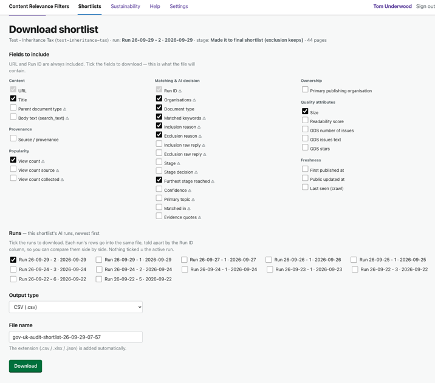
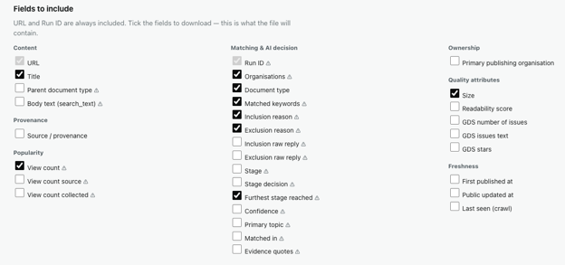
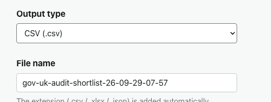

# Journey 5: Download a shortlist

*What this shows: getting the shortlist out of the tool as a file, choosing the columns you need and
the format that suits where it's going next.*

**Who / when:** anyone who needs to hand the list on, analyse it in a spreadsheet, or feed it to
another system.
**Pages used:** the **Results** tab, then **Download**.

# Journey Overview

A shortlist isn't much use trapped in a browser. From the **Results** tab, **Download** gives you a
file: pick which run to export, tick the columns you need (URL always comes along), and choose CSV,
Excel or JSON. Because every column carries its provenance, the file is as defensible as the
shortlist behind it.

---

## Getting to the download

**What you do:** open the **Results** tab for your shortlist and choose **Download**.

**What you see:** a download page with three choices: which run to export, which fields to include,
and what format to produce. It opens with sensible defaults, so you can download straight away or
fine-tune first.

> Say: "From the Results tab, hit Download. You get one screen: which version to export, which
> columns, and which file type. The defaults are already chosen, so tweak only what you care about."

**A note on which run:** if you've run the AI more than once, a **Run** selector lets you export the
list as a specific run judged it, so the file matches exactly the version you're talking about.

## 5.1: The fields you can export

**What you do:** tick the columns you want from a grouped picker. URL is always included, since it's
the one column every downstream use needs, so it's locked on. The rest are grouped so you can grab a
whole theme at once:

- **Content:** URL, Title, and heavier optional fields like the parent document type, the full body
  text, or the raw page JSON. The last two can make the file very large, and the picker warns you.
- **Provenance:** where the page came into the shortlist from.
- **Popularity:** the GOV.UK Search view count (roughly the last two weeks), and whether that count
  is the page's own or inherited from a parent publication.
- **Matching and AI:** the AI's verdict and its reasoning, so kept or dropped, the score, the reason,
  the topic it found, and where in the page the evidence was.
- **Ownership:** the organisation or organisations responsible for the page.
- **Quality:** readability and similar signals.
- **Freshness:** when the page was last updated.

**What you see:** only the ticked columns appear in the file, in a tidy order.

> Say: "Think about who's reading the file. A policy colleague might want title, URL and the AI's
> reason. An analyst might add view counts and freshness. Someone loading it into another system
> might take the raw JSON. Tick the groups you need, and URL always comes along."

**How this helps you:** the groups mirror the questions people ask of a shortlist. What is it, where
did it come from, is it read, did the AI keep it and why, who owns it, is it any good, and is it
current. So you grab a theme rather than hunting field by field.

## 5.2: Formats

**What you do:** pick an **Output type**:

- **CSV (.csv):** opens anywhere and loads into anything. The safe default for sharing.
- **Excel (.xlsx):** a real spreadsheet with formatting, best when a person will read and sort it.
- **JSON (.json):** structured data, best when another system or script will consume it.

The file extension is added for you.

**What you see:** the file downloads with the columns you picked, named after the shortlist.

> Say: "CSV if in doubt, since it opens anywhere. Excel if a person's going to live in the
> spreadsheet. JSON if a machine's going to read it. Same data, three shapes."

## Links

- Previous: [Journey 4: Run the AI](4-run-the-ai.md)
- Next: [Journey 6: How was this built?](6-how-was-this-built.md)
