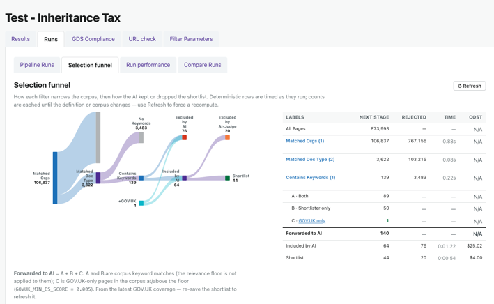
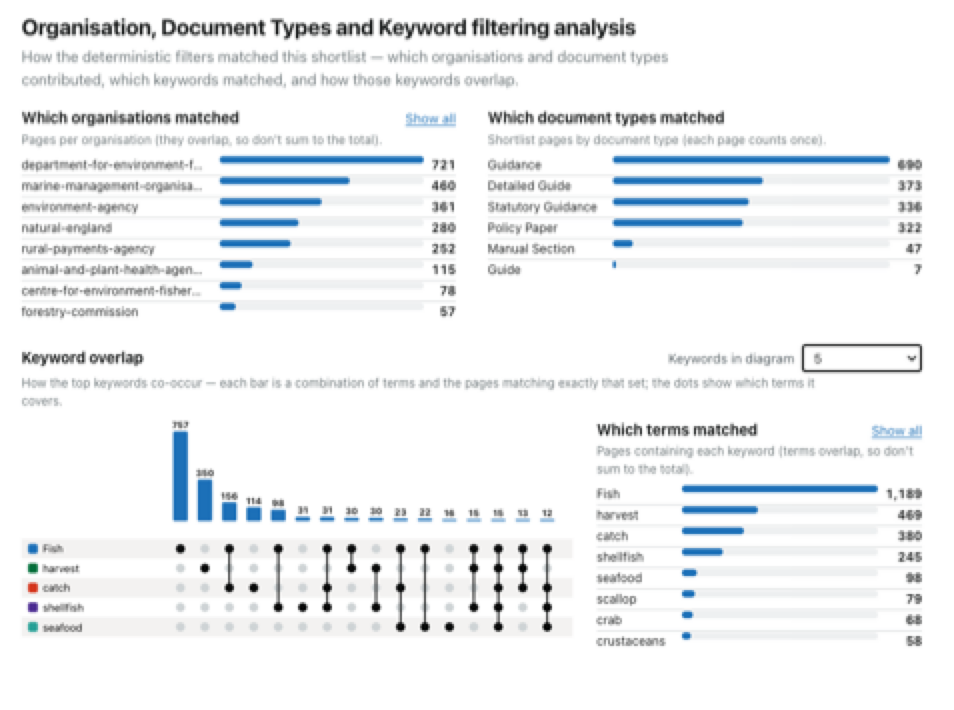
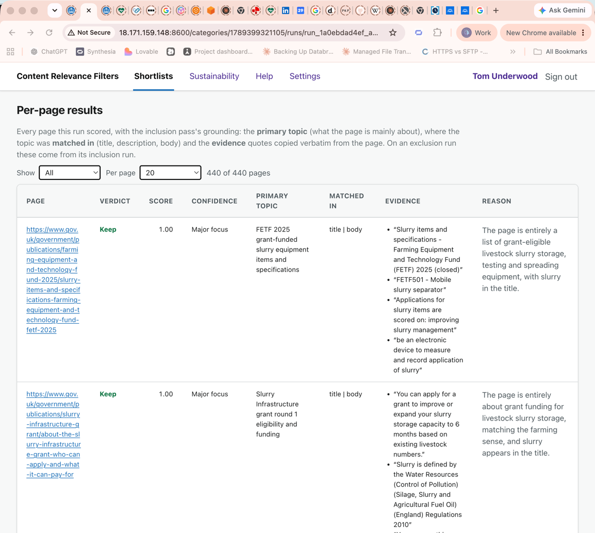
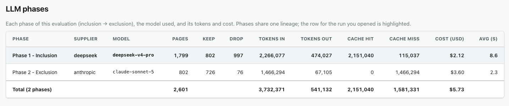
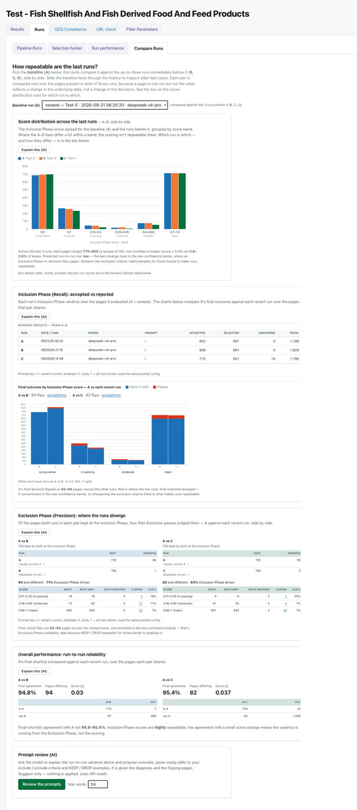

# Journey 6: How did we build the shortlist?

*What this shows: how to trust a shortlist. See how the Filter Parameters generated it, which pages
were kept or dropped and why, what the AI decided, and how the AI can help you sharpen the question.*

**Who / when:** anyone about to rely on a shortlist, before they hand it on or make a call from it.
**Pages used:** **Results** (kept and dropped stages), **Runs** (Pipeline Runs, Selection funnel,
Run details), and **Compare Runs**.

# Journey Overview

Before you rely on a shortlist, you can see exactly how it was built. Read the funnel to see how each
filter narrowed the corpus, open any page to see whether the AI kept or dropped it and why, check
that the run finished cleanly, and, if the same pages keep flipping between runs, let the AI suggest
sharper criteria and run it again. Every step shows its working.

> **On the simple interface** you see Pipeline Runs, the Selection funnel, and each run's details.
> A few power-user extras stay hidden until you switch to the advanced interface: the **Compare Runs**
> tab (§6.5), the **Run performance** metrics tab, and the **Trial (A/B)** run options (prompt
> wording, pages at a time, prompt caching) on New Run. You need none of them to build, run, check and
> tune a shortlist.

---

## 6.1: The selection funnel

> "This is the shortlist's autobiography. Start at all of GOV.UK, and each filter knocks the
> number down, organisation, then page type, then keywords, until the AI takes the survivors and
> makes the judgement calls. If a stage cuts far more or far less than you expected, that's your clue
> something in the Filter Parameters needs a tweak."

**What you do:** open the **Runs** tab, then its **Selection funnel** sub-tab, and look at the funnel
table. The **Keyword Matching** breakdowns (which organisations, page types and terms matched) are
folded in lower down the same tab.

**What you see:** the page count dropping stage by stage, in the order the Filter Parameters were
applied. All pages (the whole corpus), then after the organisation filter (only the owner you
picked), then after the document-type filter, then after the keyword filter, and finally the AI pass,
where Inclusion scores and keeps and Exclusion re-checks and drops.

**How this helps you:** the funnel turns "trust me" into "look". You can see which single filter did
the heavy lifting, and whether the drop at each step matches what you intended.

## 6.2: How organisation, document type and keywords narrow the field

> "The funnel gives you the headline drop at each stage; these breakdowns give you the reasons.
> One organisation or one keyword usually does most of the work — here 'Fish' alone caught 1,189
> pages while the rarer terms add a handful each. If a keyword matches almost nothing, or one
> organisation dominates far more than you expected, that's exactly what to adjust in the Filter
> Parameters before you spend any AI budget."

**What you do:** stay on the **Selection funnel** sub-tab and scroll below the funnel to the
**Organisation, Document Types and Keyword filtering analysis** breakdowns.

**What you see:** three views that explain *why* each deterministic stage cut what it did. **Which
organisations matched** ranks the publishers behind the pages (they overlap, so they don't sum to the
total). **Which document types matched** counts the shortlist by page type, each page once. And the
keyword views show **Which terms matched** — the pages each keyword caught — alongside a **Keyword
overlap** diagram, where each bar is a combination of terms and the pages matching exactly that set,
with dots marking which terms it covers.

**How this helps you:** every page these deterministic filters remove is a page the AI never has to
read, so tightening them is the cheapest way to cut both cost and noise. The breakdowns show which
filter is pulling its weight and which keyword or organisation is too broad or too narrow, so you can
shrink the set forwarded to the AI with intent rather than guesswork.

## 6.3: What was kept or dropped, and why

> "Pick a stage and you can read the actual decisions. For the AI steps you get a keep or drop,
> a confidence score, and a one-line reason: 'kept, sets out slurry storage standards', 'dropped,
> slurry here means concrete'. If you disagree with a call, you've found something to fix in the
> criteria."

**What you do:** on the **Results** tab, switch the stage view to see the pages a given step kept or
dropped, and open the AI's verdict on individual pages.

**What you see:** each row shows the page and, for the AI stages, whether it was kept or dropped, a
score, and a reason in plain English, along with the evidence it leaned on. You can answer "why this
page?" for any row.

**How this helps you:** a shortlist you can audit row by row is one you can defend, and every
disagreement you spot is a concrete edit for the include or exclude criteria, or a new Keep or Drop
example.

## 6.4: Reading the two-phase pipeline

> "Running the AI is two passes: a generous first read that scores and keeps, then a strict
> second read that only removes. Every run is kept in the list with its cost and outcome, and if one
> stops short, its page tells you plainly why."

**What you do:** open a run from **Pipeline Runs** to reach its **Run details** page. Starting,
completing and repairing runs is [Journey 4: Run the AI](4-run-the-ai.md); here we're reading what a
run decided.

**What you see:** the run works in two passes. Inclusion scores every page from 0 to 1 and keeps
anything above zero; Exclusion then re-checks the keeps and can only drop. The page shows each phase's
pages, keep and drop counts, tokens and cost, a **Run outcome** panel at the top saying whether it
finished and, if not, why, and the per-page verdicts (kept or dropped, score and reason), the same
ones you saw on the Results stages.

**How this helps you:** you're not trusting a single opaque score. You can see both passes, what each
cost, and whether the run actually finished, so a kept page has clearly earned its place.

## 6.5: Letting the AI reframe your question

> "Ask the AI why your runs disagree, and it hands you tighter wording and the examples that
> would settle the coin-flips. Tick the ones you like, and it takes you straight to a new run."

**What you do:** open **Runs**, then **Compare Runs**. Pick a baseline run and it's set against your
recent runs, so you can see how repeatable they are: the spread of scores, and where the Inclusion
and Exclusion phases agree or diverge. Each card has an **Explain this (AI)** button for a
plain-English read. Then use **Review the prompts**, and the AI reads how the runs diverged and the
pages that flipped and suggests sharper criteria and Keep or Drop examples. An **Apply to shortlist**
card lets you accept the ones you want and takes you back to **Pipeline Runs** to run again.

**How this helps you:** when a shortlist is nearly right but the same borderline pages keep flipping,
the AI turns your own results into tighter wording, so each pass is steadier than the last. The same
review is on the **Filter Parameters** page too, where you apply suggestions straight into each box.
[Journey 7: Edit your Filter Parameters](7-edit-filter-parameters.md) covers that side, and the
important point that the suggestions are informed by your data, not your intent.

## Links

- Previous: [Journey 5: Download a shortlist](5-download-a-shortlist.md)
- Next: [Journey 7: Edit your Filter Parameters](7-edit-filter-parameters.md)
- Back to the start: [Journey 2: What is a shortlist?](2-what-is-a-shortlist.md)
- The criteria you'll be tuning are set in [Journey 3: Create a shortlist](3-create-a-shortlist.md).
