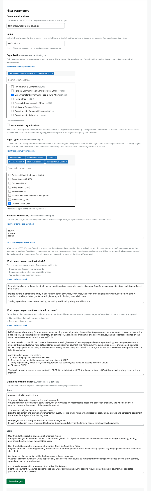
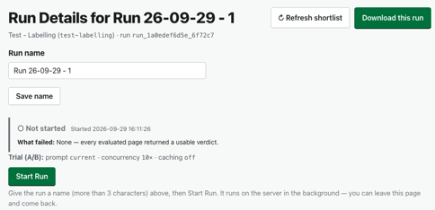
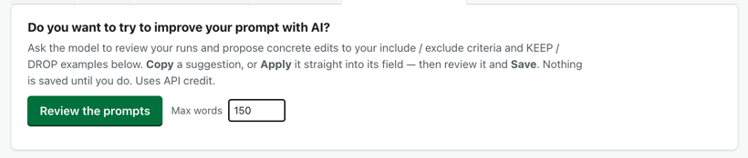
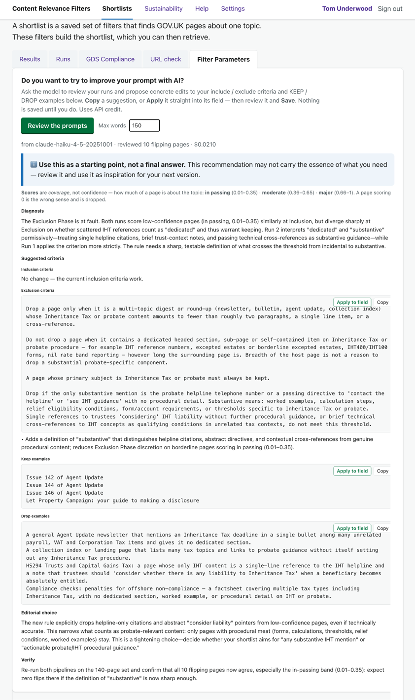

# Journey 7 — Edit your Filter Parameters (and re-run)

*What this shows: how to change an existing shortlist's Filter Parameters, why the change only
counts once you run again, and how the AI can read your previous results and suggest sharper
Inclusion / Exclusion prompts.*

**Who / when:** you've run the AI at least once (Journey 4) and reviewed the results (Journey 6) —
the shortlist is close, but you want to tighten what it keeps or drops.
**Pages used:** **Filter Parameters** (edit) · **Runs → Pipeline Runs**.

---

## The 30-second pitch

> Say: "A shortlist is never carved in stone — you tune it. Open Filter Parameters, change what you
> want, and save. The one thing to remember: editing changes what the *next* run will do — your
> existing results don't rewrite themselves, so you run again. And if you're not sure *how* to
> sharpen the wording, the tool will read your own runs and suggest it."

---

## 7.1 — Change the parameters

**What you do:** open the **Filter Parameters** tab for your shortlist. Change whatever isn't quite
right — the **organisation**, **document types** or **keywords** that pick the pages, or the
**Inclusion / Exclusion criteria** and **Keep / Drop examples** that steer the AI. Then **Save**.

**What you see:** on save, the tool regenerates the shortlist from your new parameters (the
mechanical filters take effect straight away) and moves you on.

> Say: "Same form you filled in to create it — just change the bits that need it and save. The
> filters, the org, the page types, the keywords, and the words that guide the AI: all editable, any
> time."

**Why it matters:** the shortlist is a living definition, not a one-off. Tuning the parameters is the
normal way you make it sharper.

---

## 7.2 — Editing changes the *next* run — so run again

**What you do:** after you save, start a **New Run** (Journey 4) from **Runs → Pipeline Runs**.

**What you see:** your **existing** runs are unchanged — each one is a fixed record of the pages and
prompts *as they were when it ran*. Changing the criteria doesn't re-judge old results; it changes
what a **new** run will do. So the AI keep/drop decisions only reflect your edits **after you run
again**.

> Say: "This is the one thing people trip over. Saving new criteria does *not* rewrite the results
> you already have — those are a snapshot. To see your changes in the AI's verdicts, you start a new
> run. Edit, save, re-run: that's the loop."

**Why it matters:** it keeps every run honest and comparable — a run always shows what *it* decided,
not what a later edit would have decided. The price is that you re-run to apply a change.

---

## 7.3 — Let the AI suggest how to sharpen the prompts

**What you do:** once you've done at least one run, the Filter Parameters page shows a card at the
top: **"Do you want to try to improve your prompt with AI?"**. Set a word limit if you like and press
**Review the prompts**.

**What you see:** the AI reads your **previous results** — how much your runs agreed with each other
(**repeatability**) and how cleanly they separated keeps from drops (**discrimination**), plus the
borderline pages that flipped — and proposes reworded **Inclusion / Exclusion criteria** and **Keep /
Drop examples**. Each suggestion has an **Apply to field** button that drops the wording straight
into its box (and a **Copy** button). It works even after a **single** run — it critiques that one on
its own.

> Say: "Here's the helper. Once you've got a run or two, the AI will read them back and tell you
> where the wording is letting borderline pages wobble — then hand you tighter Inclusion and
> Exclusion text and the exact Keep/Drop examples that would settle them. One click drops each into
> the box. It's turning your own results into a better prompt."

**Why it matters:** the hardest part of tuning is knowing *what* to change. This points you at the
specific wording your own runs suggest would make future runs steadier and more decisive.

---

## 7.4 — Read the suggestions as inspiration, not instructions

**What you do:** before you accept a suggestion, read it against what you actually need.

**What you see:** the card says it plainly — **"Use this as a starting point, not a final answer.
This recommendation may not carry the essence of what you need — review it and use it as inspiration
for your next version."** The suggestions are drawn from **patterns in your data**: they make runs
more **repeatable** and better at **discriminating** keep from drop. But the AI doesn't know your
policy, your audience, or the real-world call you're making — so a wording that scores well on
consistency can still miss your intent.

**What you do next:** keep the parts that match your use case, edit the rest, **Save**, and start a
**New Run** (7.2) to see the effect.

> Say: "One honest caveat. These suggestions come from *your data*, not your *purpose* — they make
> the AI more consistent and more decisive, which is usually what you want, but they can't know what
> you actually mean the shortlist to be. So take them as a well-informed draft: keep what fits,
> change what doesn't, save, and run again. You're using the AI to improve your specificity, not to
> decide your intent."

**Why it matters:** the AI can sharpen *how* you say something far faster than you can by hand — but
you stay the judge of *what* the shortlist is for. That split is what keeps a tuned shortlist yours.

---

## Links

- Previous: [Journey 6 — How was this built?](6-how-was-this-built.md)
- The parameters explained from scratch: [Journey 3 — Create a shortlist](3-create-a-shortlist.md)
- Applying changes: [Journey 4 — Run the AI](4-run-the-ai.md)
- The same AI review from the Compare Runs side: [Journey 6.4](6-how-was-this-built.md#64--letting-the-ai-reframe-your-question)
