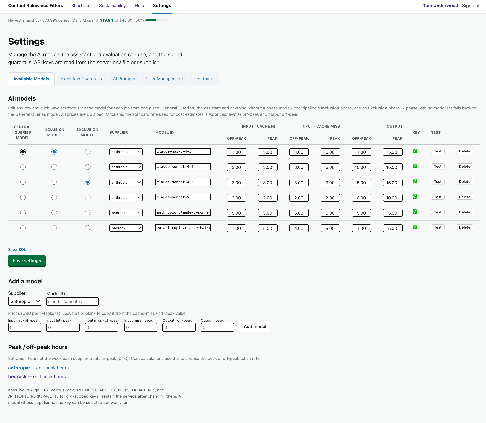
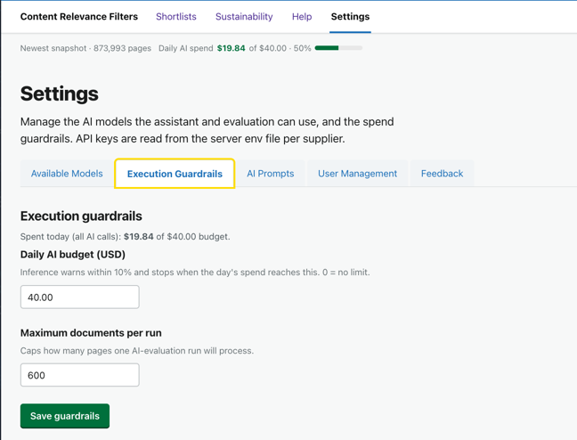
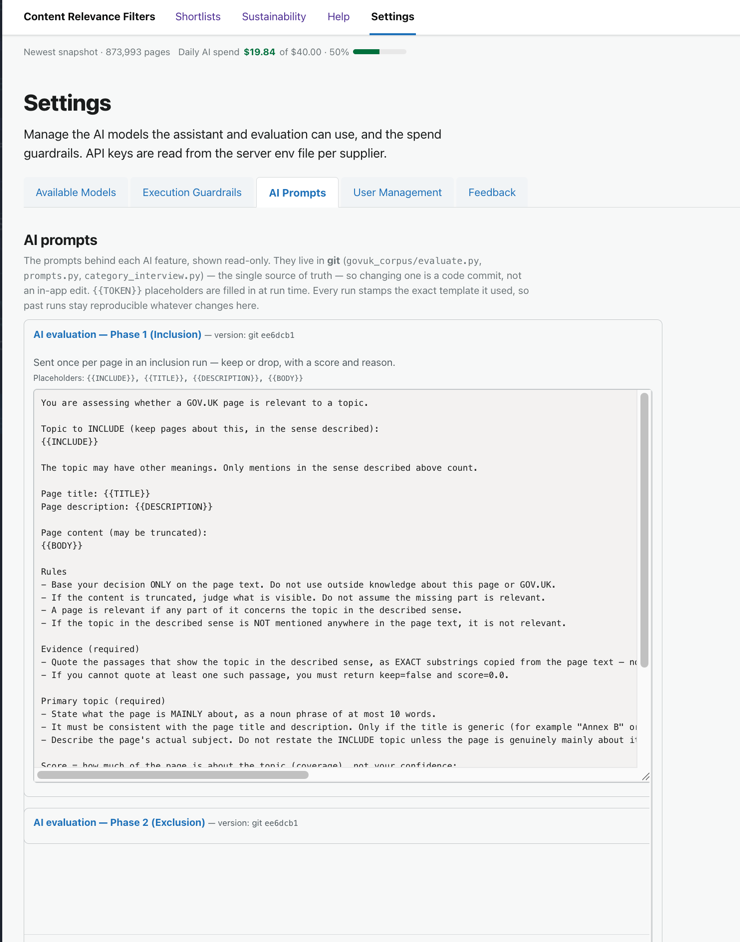
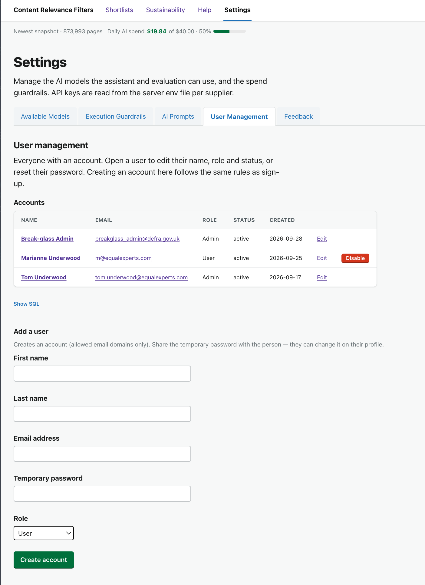
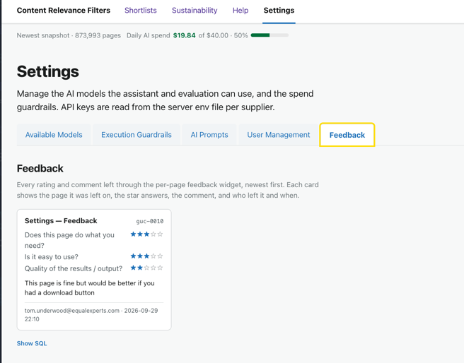

<!-- audience: admin -->
# Journey 8: Settings and administration

*Admin-only. This journey appears in the Help only for administrators, and covers the **Settings**
page and its tabs: models and pricing, execution guardrails, the AI prompts, user management, and
feedback.*

**Who / when:** administrators setting the tool up or keeping it running.
**Pages used:** **Settings** (`/settings`, admins only), its Available Models, Execution Guardrails,
AI Prompts, User Management and Feedback tabs, and the per-provider peak-hours editor.

# Journey Overview

Almost everything a normal user does needs no admin. Administration is the small set of behind-the
-scenes controls: which AI models are available and what they cost, how much the tool is allowed to
spend and how much it does per run, a read-only view of the prompts, and who has an account and what
role they hold. All of it lives on the **Settings** page, which only administrators can see.

The **Settings** link appears in the top navigation only for admins, and the page is checked again on
the server, so a non-admin can neither see nor reach it. The page has five tabs: **Available Models**,
**Execution Guardrails**, **AI Prompts**, **User Management**, and **Feedback**.

---

## 8.1: Available Models

> "This is the catalogue of models and their prices. Pick which model runs the inclusion pass and
> which runs the exclusion pass, add a new model with its rates, and set each supplier's peak hours so
> the cost is worked out correctly."

**What you do:** on the **Available Models** tab, manage the AI models the tool can use. The table
lists each model by supplier and model ID, with its full price grid: input tokens (cache hit and cache
miss, each at off-peak and peak rates) and output tokens (off-peak and peak). You can mark one model
as the **inclusion** model and one as the **exclusion** model, so each phase runs on the model you
choose. A model whose provider has no key configured is flagged, so you can see at a glance which
models are usable. **Add a model** with the form below the table (supplier, model ID, and its rates),
and open **Peak / off-peak hours** to set each supplier's weekly peak schedule.

**What you see:** the models available to a run, the rate the cost engine will charge, and which model
each phase currently uses.

**How this helps you:** models and prices change often. Keeping them here, rather than in code, means
you can switch models, add a new one, or correct a rate without a deploy, and every run is costed
against the current numbers.

## 8.2: Execution Guardrails

> "Two safety limits. A daily budget, so a runaway job can't spend the month in an afternoon, and a
> per-run page cap, so a run does a sensible batch and then stops for you to continue."

**What you do:** on the **Execution Guardrails** tab, set two limits. The **Daily AI budget (USD)**
caps total spend across all AI calls in a day; the tool warns within 10% and stops when the day's
spend reaches it, and 0 means no limit. **Maximum documents per run** caps how many pages a single run
will process. The tab also shows how much has been spent today against the budget. Press **Save
guardrails**.

**What you see:** the day's spend so far, and the two limits that protect it.

**How this helps you:** the budget is the main defence against surprise cost, and the per-run cap keeps
a large shortlist moving in steady batches rather than one unbounded run. When a run stops for either
reason, its Run outcome says so, and the user carries on with Complete run.

## 8.3: AI Prompts

> "The prompts are here to read, not to edit. They live in git, so changing one is a code commit
> rather than an in-app change, and every run records the exact prompt it used, so old runs stay
> reproducible whatever changes later."

**What you do:** on the **AI Prompts** tab, read the prompts behind each AI feature. They are shown
read-only, because the prompts live in **git** (`govuk_corpus/evaluate.py` and `prompts.py`), which is
the single source of truth. Each shows its version (a git short SHA), the placeholders it fills in at
run time, and its full text.

**What you see:** exactly what the AI is asked, and which version is current.

**How this helps you:** you can always check what the AI is actually being asked, and satisfy anyone
who wants to see it, without risk of an accidental edit changing behaviour mid-flight.

## 8.4: User Management

> "User management lives right here on this tab: add people, change roles, and reset passwords. The
> two roles that matter day to day are User and Admin."

**What you do:** on the **User Management** tab, view and edit every account, add new ones, and set
each person's role, all in place. This tab applies when the app runs in accounts mode
(`AUTH_MODE=accounts`); in shared-password mode there are no individual users to manage.

**What you see:** the list of accounts with their roles and status, and the controls to add a user,
change a role, or send a password reset.

**How this helps you:** roles decide who can reach this admin area at all. Grant Admin only to the
people who should manage the tool; everyone else is a User.

### Disabling an account

To stop someone signing in without deleting their record, press the red **Disable** button on their
row. Their status becomes **disabled**: they can no longer sign in, and any session they already have
stops working on its next request. Nothing else is removed — their shortlists and history stay — and
the button turns into **Enable**, so you can restore access with a single click.

Two safeguards mean the button simply isn't shown in those cases: you can't disable **your own**
account (so you can't lock yourself out mid-session), and the **break-glass admin** below can't be
disabled at all.

### The break-glass admin

There is one permanent emergency admin, **breakglass_admin@defra.gov.uk**. It is always allowed in
with the password held in the server environment (`BREAKGLASS_ADMIN_PASSWORD`), even if the database is
in a bad state, and it cannot be demoted, disabled or locked out. Use it to get in and grant a normal
Admin account, or to recover if admin access is ever lost, rather than as a day-to-day login. Other
admins are created the ordinary way, on the User Management tab. Rotate the break-glass password by
changing that environment value and restarting.

## 8.5: Feedback

> "The Feedback tab is where the star ratings and comments people leave through the per-page widget
> land. It's a read-only review — one card per submission, newest first — so you can see what's
> working and what isn't, page by page."

**What you do:** open the **Feedback** tab to read everything left through the small feedback widget
that sits on every page (the star questions and a free-text comment). There's nothing to set here;
it's a review.

**What you see:** one **card per submission**, newest first. Each card shows the **page title** and
its **page code** (the `guc-####` id), the three star answers — *Does this page do what you need?*,
*Is it easy to use?*, *Quality of the results / output?* — the comment, and who left it and when.
On a tabbed page the title also carries the **active tab** for context — the outer tab and any
sub-tab — so it reads like *"Slurry docs — Runs · Selection funnel"* or *"Settings — Feedback"*,
pinning the feedback to the exact view even though several views share one page code. The
**Show SQL** rolldown reveals the exact query behind the list.

**How this helps you:** it turns scattered per-page reactions into one place you can scan. The page
title (with its tab context) and code on each card tell you exactly where a problem was reported, so
you can act on the pages people actually struggle with.

## Links

- The everyday workflow these settings support starts at [Journey 2: What is a shortlist?](2-what-is-a-shortlist.md).
- Budgets and per-run limits show up to users in [Journey 4: Run the AI](4-run-the-ai.md).
- Models and prices are the same catalogue the cost figures in [Journey 6: How did we build the shortlist?](6-how-was-this-built.md) draw on.
