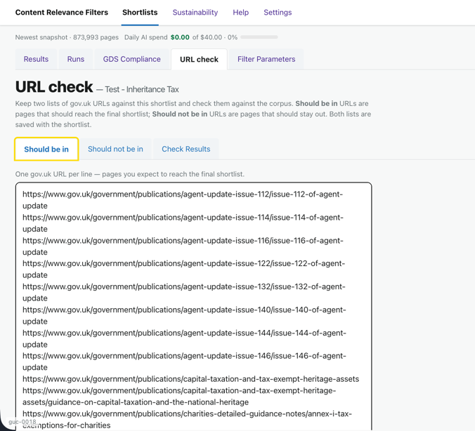
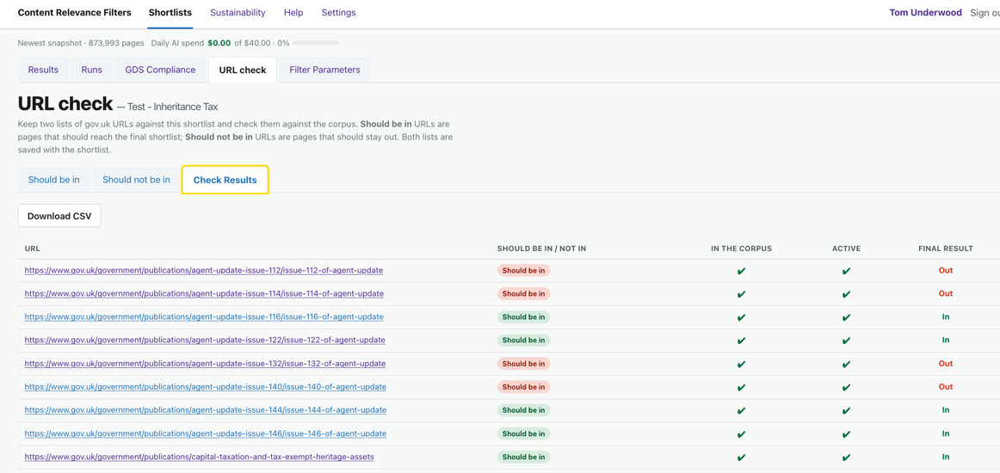

# Journey 8: Check specific URLs

*What this shows: keeping two lists of gov.uk URLs you already have an opinion about — pages that
should end up in the shortlist and pages that should not — and checking them against the shortlist to
see whether it agrees.*

**Who / when:** you have a shortlist and some known-good and known-bad example pages (from a
colleague, a spec, or your own review) and you want to confirm the filters and the AI are treating
them the way you expect.
**Pages used:** the **URL check** tab on a shortlist.

# Journey Overview

The URL check is how you hold a shortlist to account against pages you already know the answer for.
You paste in the gov.uk URLs that *should* be included and the ones that *should not*, and the tool
tells you, for each, whether it made it through the corpus, the latest run, and into the final
shortlist. Green means the shortlist agrees with you; red means it doesn't — and that's your prompt
to tune the Filter Parameters. Both lists are saved with the shortlist, so the check is repeatable.

---

## 8.1: Keep your "should be in" and "should not be in" lists

> "Two lists of gov.uk URLs you already have a view on: pages that ought to be in the shortlist, and
> pages that ought to stay out. One URL per line. They save with the shortlist, so they're your
> standing set of test cases."

**What you do:** open the **URL check** tab. On **Should be in**, paste the gov.uk URLs you expect to
reach the final shortlist, one per line; on **Should not be in**, the URLs you expect it to exclude.
Save.

**What you see:** the two lists stored against this shortlist. The "Should be in" list is the same
expected-includes list the shortlist already holds, so it stays consistent with the rest of the
definition.

**How this helps you:** it turns "I think this page should be in there" into a written, saved
expectation the tool can be measured against — the basis of the check.

## 8.2: Run the check and read the result

> "Open Check Results and it runs there and then. For every URL you get a row: is it in the corpus,
> did the latest run keep it, and is it in the final shortlist — with a green tick when the shortlist
> agrees with your list and a red cross when it doesn't."

**What you do:** open the **Check Results** tab (it re-runs the check each time you open it). Read
down the rows, and **Download CSV** if you want the results outside the app.

**What you see:** one row per URL, with columns for **In the corpus**, **Active** (the current run's
decision) and **Final result** (whether it's in the shortlist now). Each row is scored against your
intent: a **Should be in** URL passes when its final result is *In*; a **Should not be in** URL
passes when its final result is *Out*. A pass shows green, a miss shows red.

**How this helps you:** the red rows are your worklist. A "should be in" page that never reached the
corpus points at your organisation or keyword filters; one dropped by the AI points at the include /
exclude criteria. A "should not be in" page that slipped through tells you where to tighten. Either
way you've turned a hunch into a specific fix — then re-run and re-check.

## Links

- Previous: [Journey 7: Edit your Filter Parameters](7-edit-filter-parameters.md)
- Tuning the filters and criteria a failed check points to: [Journey 7: Edit your Filter Parameters](7-edit-filter-parameters.md)
- Seeing how each filter narrowed the corpus: [Journey 6: How did we build the shortlist?](6-how-was-this-built.md)
